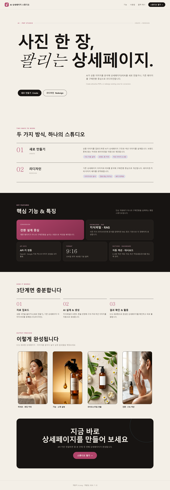
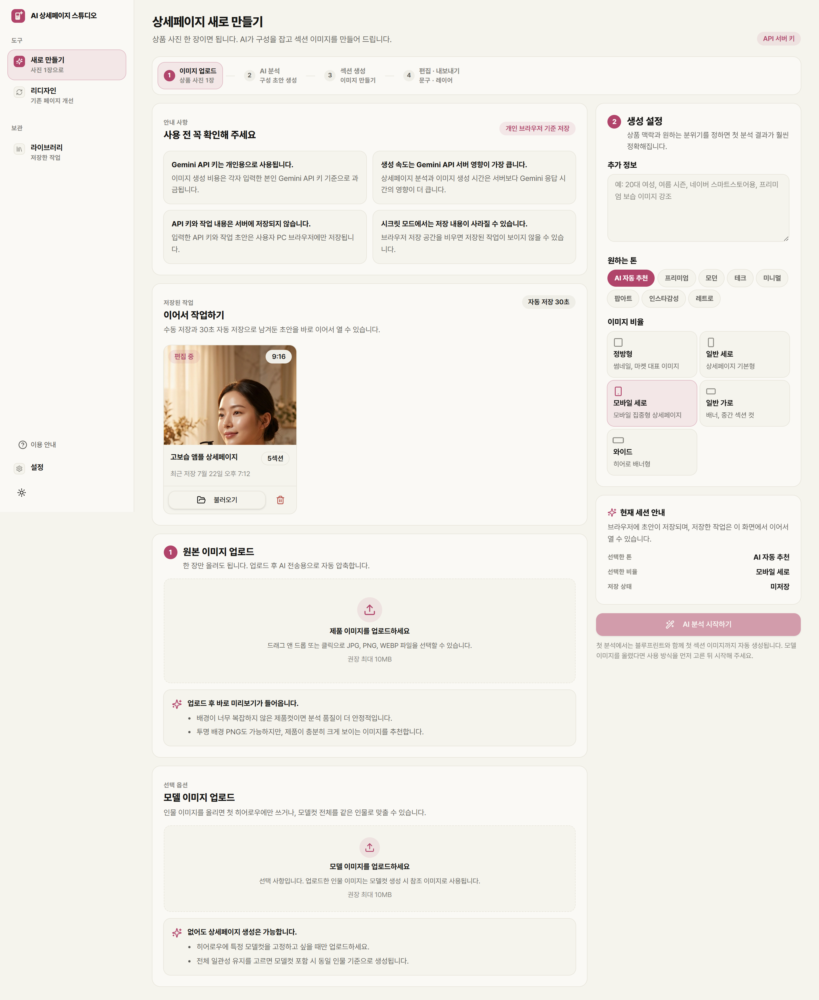
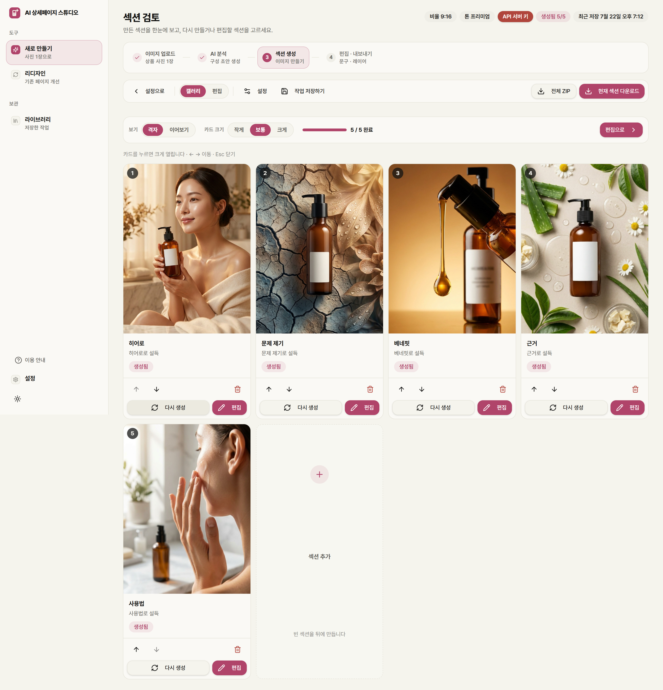
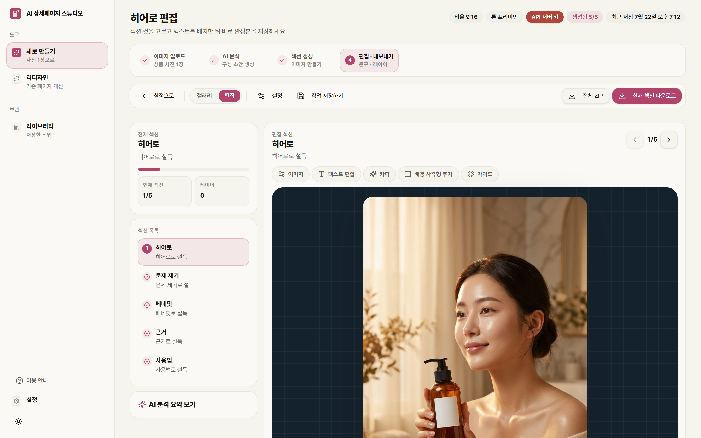
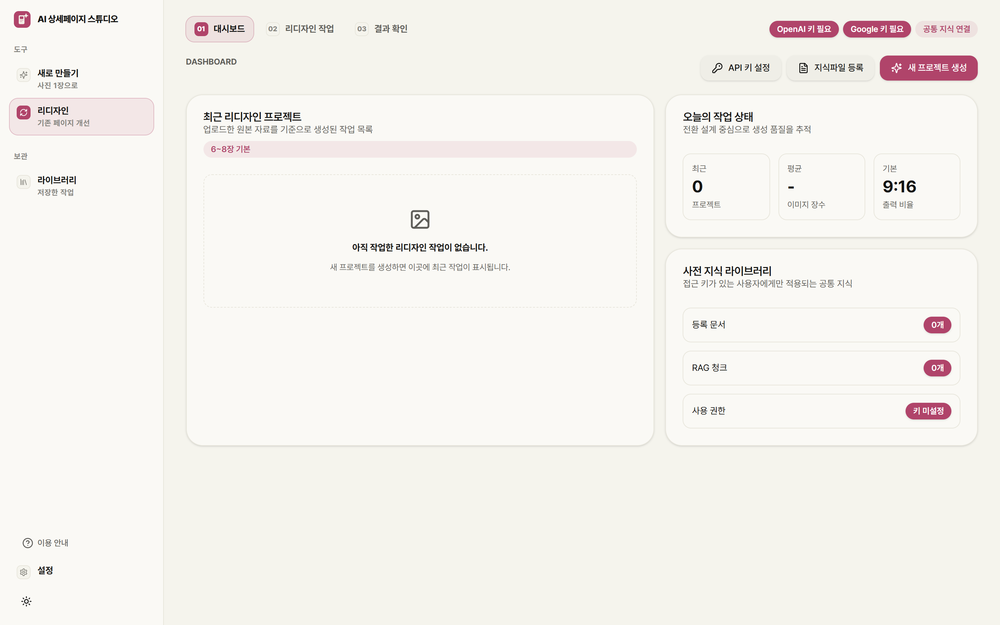
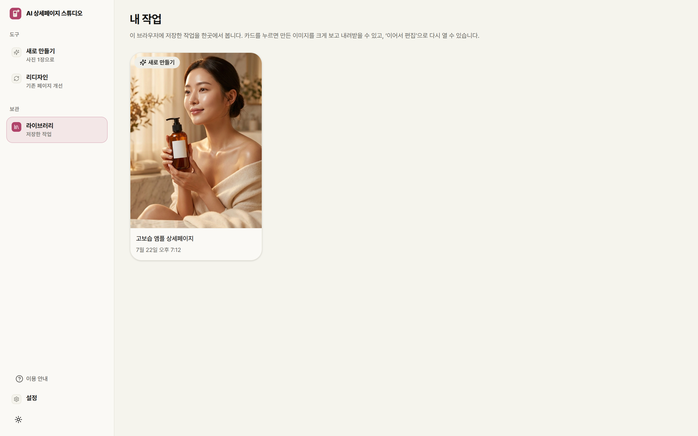
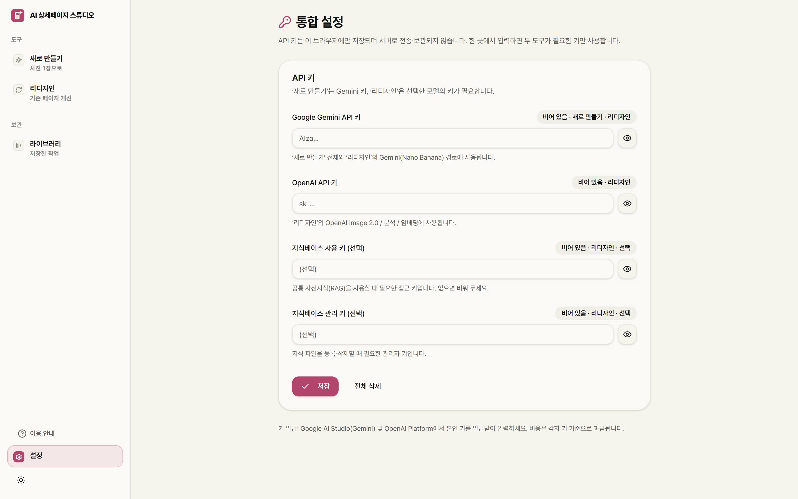

# PDP STUDIO — 시스템 소개

> **상품 사진 한 장으로 이커머스 상세페이지를 만들고, 기존 페이지를 전환율 중심으로 개선하는 AI 통합 스튜디오.**
>
> 라이브: **https://detail-page-studio-web.vercel.app**

한이룸 상세페이지 도구 2건(`redesign-maker-10` + `pdp-maker-201`)을 하나의 앱으로 통합한 것으로, 현재 쓰는 최신 상세페이지 시스템입니다.

---

## 1. 무엇을 하는 시스템인가

이커머스 셀러가 **상세페이지(제품 소개 이미지)를 만드는 데 드는 시간과 비용을 없애는** 도구입니다. 두 가지 방식을 하나의 스튜디오에서 제공합니다.

| 도구 | 하는 일 | 필요한 것 |
|---|---|---|
| **새로 만들기** | 상품 사진 1장 → AI가 상세페이지 구조를 설계하고 섹션별 이미지를 생성 | 제품 사진 1장 |
| **리디자인** | 기존 상세페이지(이미지·PDF)를 분석해 구매 전환 중심으로 개선 | 기존 페이지 파일 |

이미지 생성에는 Google의 **Nano Banana Pro (Gemini 3 Pro Image)** 를 쓰며, **2K 고해상도**로 뽑습니다.

---

## 2. 어디에 활용하나

- **네이버 스마트스토어·쿠팡·자사몰 셀러** — 신제품을 올릴 때마다 상세페이지가 필요한데, 사진 한 장이면 몇 분 만에 완성합니다.
- **디자인 외주 없이 자체 제작** — 포토샵·모델 촬영·스튜디오 대여 없이, AI가 모델컷·연출컷·플랫레이까지 만듭니다.
- **A/B 테스트용 빠른 변형** — 톤·비율·구성을 바꿔 여러 버전을 빠르게 생성합니다.
- **기존 페이지 리뉴얼** — 오래된 상세페이지를 리디자인 도구로 전환율 관점에서 개선합니다.
- **소규모 브랜드·1인 사업자** — 마케팅 인력이 없어도 전문가 수준의 상세페이지를 확보합니다.

---

## 3. 특장점

- **사진 1장이면 충분** — 제품컷 한 장을 넣으면 AI가 히어로·문제 제기·베네핏·근거·사용법 등 **판매에 필요한 섹션 구성을 스스로 설계**합니다.
- **모델컷까지 자동 생성** — 인물이 제품을 사용하는 장면, 연출컷, 성분 플랫레이 등 촬영이 필요했던 이미지를 AI가 만듭니다.
- **2K 고해상도** — 상세페이지는 확대해서 보는 물건이라, 흐리지 않게 고해상도로 뽑습니다.
- **한눈에 검토하는 갤러리** — 만든 섹션들을 격자로 모아 보고, 크게 확대(모달)하거나 세로로 이어 붙여(이어보기) 최종 모습을 확인합니다.
- **섹션 순서 변경·추가·삭제** — 텍스트 레이어가 섹션을 따라오도록 설계돼, 순서를 바꿔도 내용이 어긋나지 않습니다.
- **섹션별 재생성·편집** — 마음에 안 드는 섹션만 다시 만들거나, 텍스트·도형 레이어를 얹어 다듬습니다.
- **결과물 보관함** — 만든 작업을 라이브러리에 모아두고, 다시 열거나 이미지를 내려받습니다.
- **개인 키 방식** — API 키는 브라우저에만 저장되고 서버로 나가지 않습니다(각자 키 기준 과금).
- **한 곳에서 두 도구** — 새로 만들기와 리디자인을 하나의 통합 디자인으로 오갑니다.

---

## 4. 작업 흐름

```
① 이미지 업로드 → ② AI 분석(구조 설계) → ③ 섹션 생성(갤러리) → ④ 편집·내보내기
```

분석은 구조만 빠르게 만들고, 이미지는 갤러리에서 한 장씩 생성합니다. 완성되면 섹션별 또는 전체 ZIP으로 내려받습니다.

---

## 5. 화면 소개

### 랜딩페이지
방문자가 처음 만나는 소개 화면. "스튜디오 열기"로 작업 페이지에 진입합니다.



### 새로 만들기 — 설정
제품 사진을 올리고, 추가 정보·톤·이미지 비율을 정합니다.



### 섹션 갤러리
AI가 만든 섹션들을 격자로 한눈에 검토합니다. 카드 크기 조절, 크게 보기(모달), 이어보기, 섹션 순서 변경·추가·삭제, 섹션별 재생성이 모두 여기서 됩니다.



### 편집기
섹션 이미지를 고르고 텍스트·도형 레이어를 배치해 완성본을 다듬습니다.



### 리디자인
기존 상세페이지를 분석해 전환율 중심으로 개선합니다.



### 라이브러리
만든 작업을 모아 보고, 결과 이미지를 크게 보거나 내려받고, 이어서 편집합니다.



### 설정
API 키를 입력하고 관리합니다. 키는 브라우저에만 저장됩니다.



---

## 6. 기술 구성

- **프론트엔드** — Next.js(App Router), Tailwind, 공통 디자인 시스템(다크모드 지원)
- **백엔드** — 얇은 API 어댑터가 보존된 두 코어(`pdp-core`·`redesign-core`)에 위임
- **AI** — 분석 `gemini-3.1-pro-preview`, 이미지 `gemini-3-pro-image-preview`(Nano Banana Pro)
- **구조** — pnpm 모노레포, 단일 Next.js 앱으로 배포
- **저장** — 작업 초안은 브라우저 IndexedDB, 키는 localStorage(서버 미전송)

> 개발자: Is.Jung · 개발일: 2026. 7. 22
