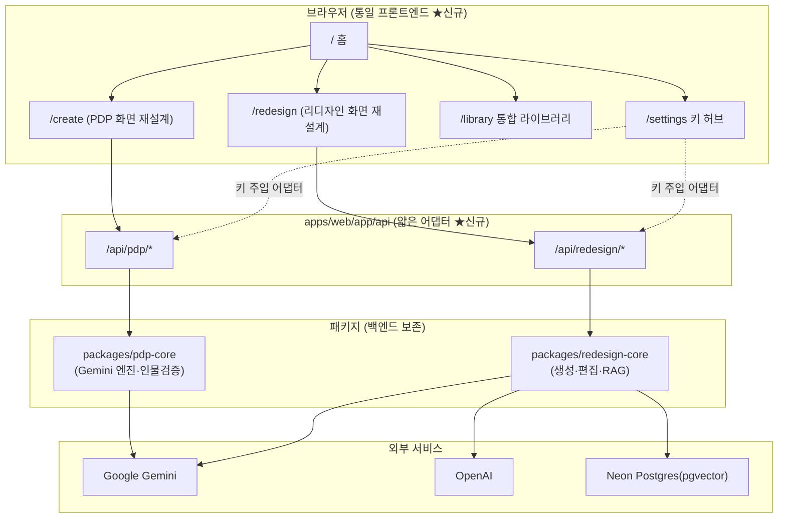
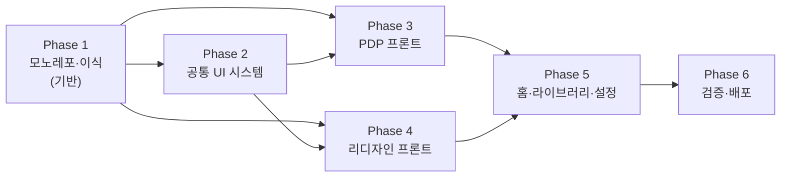
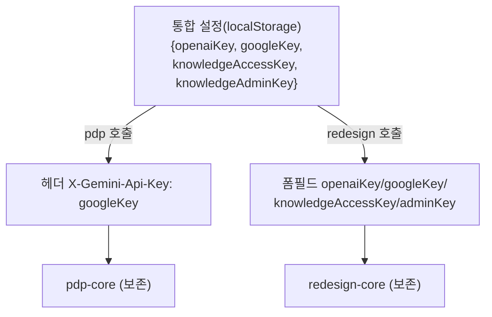

# AI 상세페이지 스튜디오 통합 구현 플랜 (AI Detail Page Studio Integration Implementation Plan)

> **For agentic workers:** REQUIRED SUB-SKILL: Use superpowers:subagent-driven-development (recommended) or superpowers:executing-plans to implement this plan task-by-task. Steps use checkbox (`- [ ]`) syntax for tracking.

**Goal:** redesign-maker-10(상세페이지 리디자인)과 pdp-maker-201(상세페이지 생성) 두 도구를, 백엔드 로직은 보존하고 프론트엔드는 전면 재설계하여, 단일 pnpm 모노레포 + 단일 Vercel 배포의 통합 플랫폼 "AI 상세페이지 스튜디오"로 합친다.

**Architecture:** `apps/web`(신규 통일 Next.js 프론트엔드)이 `packages/pdp-core`·`packages/redesign-core`(보존된 두 백엔드)를 얇은 API 어댑터로 호출한다. 두 core는 서로를 호출하지 않으며(독립 동작), 공통 디자인 시스템(`packages/ui`)으로 UI를 통일한다.

**Tech Stack:** pnpm workspace, Next.js(App Router), React 18, TypeScript, Tailwind CSS v4, shadcn/ui, `@google/genai`(pdp), `openai`+`@neondatabase/serverless`(redesign).

---

## 현황 및 변경 이력 (2026-06-25 동기화)

> 이 섹션은 구현 완료 후 설계 대비 정밀 감사(병렬 4-에이전트 + 직접 검증) 결과와 이후 결정을 반영한다. **갭은 "설계대로 구현(코드 맞춤)" 방향으로 처리한다.**

**제품명 변경:** "한이룸 스튜디오 / Hanirum Studio / `@hanirum/*`" → **"AI 상세페이지 스튜디오 / AI Detail Page Studio / `@fixup/*`"**, 루트 name `detail-page-studio`. 문서·README·화면 표시명·패키지 스코프·import 경로 전부 교체. **단, `redesign-core` 프롬프트 내 "한이룸/HANEERUM" 브랜드 금지 룰은 보존된 백엔드 로직이므로 그대로 유지**(generate.ts:401, edit-section.ts:77).

**감사 결과(조치 불필요):**
- 백엔드 보존 — pdp-core/redesign-core **FAITHFUL**(프롬프트·모델ID·RAG·인물검증·에러코드 원본 그대로). pdp의 유일 변경은 의도된 보안 수정(API키 URL→`x-goog-api-key` 헤더).
- 프론트 기능 동등성 — /create·/redesign **FULL**. IndexedDB 저장소명(`hanirum-pdp-maker`, `hanirum-redesign-projects`) 보존(둘 다 version 1).
- `pnpm -r typecheck` 0 errors · `pnpm --filter @fixup/web build` exit 0.

**예정 작업(설계대로 구현) — 2026-06-25 구현 진행:**
- [x] (Phase 5 보완) 통합 라이브러리 **삭제** 기능 — `lib/library.ts`에 `deleteLibraryItem`/`deleteRedesignProject` 추가, `library/page.tsx`에 삭제 버튼+confirm. 브라우저 end-to-end 검증(시드→삭제→IndexedDB count:0).
- [x] (Phase 3/4 보완) **서버 env 키 폴백** — `apps/web/lib/server-keys.ts` 신규(`resolveGeminiKey`/`resolveOpenaiKey`/`resolveGoogleKey`), PDP 3 + redesign generate/edit-section 어댑터에 연결. core 무손상.
- [x] (Phase 6 보완) **lint 파이프라인 설정** — `apps/web/.eslintrc.json`(next/core-web-vitals) + eslint·eslint-config-next 설치, 루트 `lint` 스크립트를 `--filter @fixup/web lint`로 정정. 비대화형 동작, 에러 0(경고 4: data-URL ``).
- [x] (Phase 6) **런타임 검증** — 키 없이 스모크(5화면·네비·설정 localStorage·라이브러리 삭제 end-to-end) + **키 기반 생성 실측 완료**: `validate-key` ok(두 Gemini 모델 접근), `/create` 분석→히어로 이미지 실제 생성(실사급 모델컷), `/redesign` 분석(gpt-5.5)→히어로 섹션 이미지 생성(gpt-image-2). RAG도 Neon 무료티어 연결→등록→임베딩→pgvector 저장→삭제 end-to-end.
- [x] (보강) **analyze 자동 재시도** — 모델이 가끔 `prompt_en`을 비워 INVALID_REQUEST가 나는 일시적 실패를, 어댑터(`api/pdp/analyze`)에서 1회 자동 재시도(core 무손상). 실측에서 1차 실패→재시도 성공 패턴 확인됨.

검증: `pnpm -r typecheck` 0 · `pnpm build` exit 0 · `pnpm lint` 에러 0 · 두 도구 생성 + RAG 런타임 실측.

**표기 정합 메모:** 설계 §4 다이어그램은 redesign 키 필드를 `accessKey`/`adminKey`로 표기하나, 구현은 `knowledgeAccessKey`(+지식 JSON의 `adminKey`)를 일관 사용. 기능 동일, 표기만 차이.

---

## Global Constraints

- 패키지 매니저: **pnpm** (corepack으로 활성화). npm/yarn 혼용 금지.
- 백엔드 핵심 로직(프롬프트·모델 호출·RAG·인물 검증 루프)은 **수정 금지**, 패키지 경계로 이식만 한다.
- 두 core 패키지는 서로 import 하지 않는다 (독립 동작).
- 모델 ID·미래 날짜 식별자는 **원본 그대로 보존**한다.
- 프론트엔드는 신규 작성하되 공통 디자인 시스템(`packages/ui`)을 사용한다.
- Tailwind는 **v4 단일 버전**으로 표준화한다.
- 비밀키는 코드에 하드코딩 금지. 환경변수 또는 클라이언트 BYO 키로만 주입한다.
- 출처 저장소: `IrumHahn/redesign-maker-10`, `IrumHahn/pdp-maker-201` (참조용 클론은 `.refs/` 에 두고 .gitignore).

---

## 다이어그램 1: 아키텍처 (변경 영역 강조)



## 다이어그램 2: 구현 로드맵 (Phase 의존성)



## 다이어그램 3: 데이터 플로우 (키 주입 어댑터)



---

# Phase 1 — 모노레포 스캐폴드 + 백엔드 이식 (기반)

가장 중요한 기반 단계. 완료 시 `pnpm install` + `pnpm -r typecheck` 가 통과하고, 두 백엔드 core 패키지가 빌드 가능한 상태가 된다.

### Task 1.1: pnpm 활성화 + 모노레포 루트 스캐폴드

**Files:**
- Create: `package.json` (루트), `pnpm-workspace.yaml`, `tsconfig.base.json`, `.gitignore`, `.npmrc`

- [ ] **Step 1: corepack으로 pnpm 활성화**
```bash
corepack enable pnpm && corepack prepare pnpm@9 --activate && pnpm --version
```
Expected: `9.x` 출력

- [ ] **Step 2: 루트 `package.json` 작성**
```json
{
  "name": "detail-page-studio",
  "private": true,
  "packageManager": "pnpm@9.0.0",
  "scripts": {
    "dev": "pnpm --filter @fixup/web dev",
    "build": "pnpm --filter @fixup/web build",
    "typecheck": "pnpm -r typecheck",
    "lint": "pnpm -r lint"
  }
}
```

- [ ] **Step 3: `pnpm-workspace.yaml`**
```yaml
packages:
  - "apps/*"
  - "packages/*"
```

- [ ] **Step 4: `tsconfig.base.json` (ES2022, strict, bundler resolution)**
```json
{
  "compilerOptions": {
    "target": "ES2022", "lib": ["ES2022", "DOM", "DOM.Iterable"],
    "module": "ESNext", "moduleResolution": "bundler",
    "strict": true, "esModuleInterop": true, "skipLibCheck": true,
    "resolveJsonModule": true, "isolatedModules": true, "noEmit": true,
    "jsx": "preserve"
  }
}
```

- [ ] **Step 5: `.gitignore` + `.npmrc`**
```
# .gitignore
node_modules/
.next/
.env*
!.env.example
.refs/
*.tsbuildinfo
.vercel
```
```
# .npmrc
shamefully-hoist=false
```

- [ ] **Step 6: 커밋**
```bash
git add -A && git commit -m "chore: pnpm 모노레포 루트 스캐폴드"
```

### Task 1.2: 참조용 두 저장소 클론

**Files:** Create: `.refs/redesign-maker-10/`, `.refs/pdp-maker-201/` (gitignore됨)

- [ ] **Step 1: 얕은 클론 (참조·이식 소스용)**
```bash
mkdir -p .refs
git clone --depth 1 https://github.com/IrumHahn/redesign-maker-10 .refs/redesign-maker-10
git clone --depth 1 https://github.com/IrumHahn/pdp-maker-201 .refs/pdp-maker-201
```
Expected: 두 디렉토리 생성, `.refs/` 는 git 추적 안 됨

### Task 1.3: `packages/redesign-core` 이식

**Files:**
- Create: `packages/redesign-core/package.json`, `tsconfig.json`, `src/index.ts`
- Copy(보존): `.refs/redesign-maker-10/src/lib/rag.ts` → `src/rag.ts`, `src/lib/knowledge-access.ts` → `src/knowledge-access.ts`
- Extract: `src/app/api/generate/route.ts`, `edit-section/route.ts`, `knowledge/route.ts`, `config/route.ts` 의 비즈니스 로직 → `src/generate.ts`, `src/edit-section.ts`, `src/knowledge.ts`, `src/config.ts` (요청 파싱은 어댑터로 분리, 핵심 로직 보존)

**Interfaces:**
- Produces: `generateSections(input: GenerateInput): Promise<RedesignProject>`, `editSection(input: EditInput): Promise<EditResult>`, `knowledgeStats()`, `indexKnowledge()`, `deleteKnowledge()`, `getServerConfig()`, RAG/access 유틸 re-export.

- [ ] **Step 1: `package.json`**
```json
{
  "name": "@fixup/redesign-core",
  "version": "0.0.0",
  "private": true,
  "main": "src/index.ts",
  "types": "src/index.ts",
  "scripts": { "typecheck": "tsc --noEmit" },
  "dependencies": {
    "@neondatabase/serverless": "^1.1.0",
    "openai": "^6.34.0"
  },
  "devDependencies": { "typescript": "^5" }
}
```

- [ ] **Step 2: `tsconfig.json`**
```json
{ "extends": "../../tsconfig.base.json", "include": ["src"] }
```

- [ ] **Step 3: rag.ts / knowledge-access.ts 무수정 복사**
원본 파일을 그대로 복사한다 (로직 보존). import 경로만 패키지 내부 상대경로로 조정.

- [ ] **Step 4: route 로직을 순수 함수로 추출**
각 `route.ts` 의 `POST/GET` 핸들러 본문에서 `NextRequest`/`NextResponse` 의존부를 분리하고, 입력은 plain 객체, 출력은 plain 객체/에러를 반환하는 함수로 옮긴다. AI 호출·프롬프트 빌더(`buildSections`, `analyzeSource`, `generateOpenAIImage`, `generateGoogleImage`, `humanizeProviderError` 등)는 **그대로 보존**.

- [ ] **Step 5: `src/index.ts` 배럴 export**

- [ ] **Step 6: typecheck + 커밋**
```bash
pnpm --filter @fixup/redesign-core typecheck
git add -A && git commit -m "feat: redesign-core 백엔드 로직 이식(보존)"
```
Expected: typecheck 0 errors

### Task 1.4: `packages/pdp-core` 이식

**Files:**
- Create: `packages/pdp-core/package.json`, `tsconfig.json`, `src/index.ts`
- Copy(보존): `.refs/pdp-maker-201/apps/web/lib/pdp-server/*` → `src/`, `.refs/pdp-maker-201/packages/shared/src/pdp.ts` → `src/types.ts`
- 제외(이식 안 함): tennis/hanirum/editorial, `apps/api`, sourcing/trend Prisma 일체

**Interfaces:**
- Produces: `analyzeProduct(input, apiKey): Promise<PdpAnalyzeResponse>`, `generateSectionImage(input, apiKey): Promise<PdpGenerateImageResponse>`, `validateApiKey(apiKey): Promise<PdpValidateApiKeyResponse>`, `PdpErrorCode`, 관련 타입 re-export.

- [ ] **Step 1: `package.json`**
```json
{
  "name": "@fixup/pdp-core",
  "version": "0.0.0",
  "private": true,
  "main": "src/index.ts",
  "types": "src/index.ts",
  "scripts": { "typecheck": "tsc --noEmit" },
  "dependencies": { "@google/genai": "^1.46.0" },
  "devDependencies": { "typescript": "^5" }
}
```

- [ ] **Step 2: `tsconfig.json`** (Task 1.3 Step 2 와 동일 내용)

- [ ] **Step 3: pdp-server 로직 무수정 복사** — `pdp.service.ts`, `pdp.controller.ts`, 프롬프트 빌더, 인물검증(`validateGeneratedImage`, `ReferenceModelProfile`), `retryOperation` 등 그대로.

- [ ] **Step 4: 컨트롤러를 순수 함수 진입점으로 노출** — Next 의존부 분리, 핵심 로직 보존.

- [ ] **Step 5: `src/index.ts` 배럴 export**

- [ ] **Step 6: typecheck + 커밋**
```bash
pnpm --filter @fixup/pdp-core typecheck
git add -A && git commit -m "feat: pdp-core 백엔드 로직 이식(보존, 레거시 제외)"
```
Expected: typecheck 0 errors

### Task 1.5: `packages/shared` (교차 타입)

**Files:** Create: `packages/shared/package.json`, `tsconfig.json`, `src/index.ts`

**Interfaces:**
- Produces: `UnifiedSettings` 타입 `{ openaiKey?, googleKey?, knowledgeAccessKey?, knowledgeAdminKey? }`, `LibraryItem` 타입 `{ id, tool: "pdp"|"redesign", title, thumbnail?, createdAt }`.

- [ ] **Step 1~3:** package.json/tsconfig/index.ts 작성, 위 타입 정의, typecheck, 커밋.

### Task 1.6: `apps/web` 최소 부트스트랩 + 빌드 베이스라인

**Files:** Create: `apps/web/package.json`, `next.config.mjs`, `tsconfig.json`, `app/layout.tsx`, `app/page.tsx`(임시 placeholder)

- [ ] **Step 1: Next.js 앱 package.json** (`@fixup/web`, next/react/react-dom, 워크스페이스 의존 `@fixup/pdp-core`/`@fixup/redesign-core`/`@fixup/ui`/`@fixup/shared` `workspace:*`)
- [ ] **Step 2: `next.config.mjs`** — `transpilePackages: ["@fixup/pdp-core","@fixup/redesign-core","@fixup/ui","@fixup/shared"]`
- [ ] **Step 3: 임시 layout/page** — "AI 상세페이지 스튜디오" 텍스트만
- [ ] **Step 4: 설치 + 빌드 베이스라인**
```bash
pnpm install
pnpm -r typecheck
pnpm --filter @fixup/web build
```
Expected: install 성공, typecheck 0 errors, build 성공
- [ ] **Step 5: 커밋** `chore: apps/web 부트스트랩 + 빌드 베이스라인`

**Phase 1 완료 기준(검증):** `pnpm install` 성공 · `pnpm -r typecheck` 0 errors · `pnpm --filter @fixup/web build` exit 0.

---

# Phase 2 — 공통 디자인 시스템 (`packages/ui`)

shadcn/ui(new-york) 기반 공통 컴포넌트·토큰·다크모드. 두 프론트엔드가 공유.

### Task 2.1: `packages/ui` 셋업 + Tailwind v4 프리셋
- shadcn 베이스 컴포넌트(button, card, dialog, input, textarea, badge 등) 이식, 디자인 토큰(색/폰트/라운드/그림자) 정의, 다크모드 토글, 반응형 유틸. 산출물: `@fixup/ui` export.

### Task 2.2: 공통 레이아웃 셸 (네비게이션·테마 프로바이더)
- 상단 네비게이션(홈/새로만들기/리디자인/라이브러리/설정), 다크모드 프로바이더, 토스트/에러 표시 컴포넌트.

**Phase 2 완료 기준:** `pnpm --filter @fixup/ui typecheck` 통과 · Storybook 불요(YAGNI), `apps/web` 에서 컴포넌트 import 빌드 성공.

---

# Phase 3 — PDP "새로 만들기" 프론트엔드 (`/create`)

pdp-maker UI를 공통 디자인 시스템으로 재구성. 기능 동등: 업로드·옵션·처리·에디터(레이어/재생성/한·영 카피/색추천/내보내기).

### Task 3.1: `/api/pdp/{validate-key,analyze,images}` 얇은 어댑터
- `apps/web/app/api/pdp/*/route.ts` 가 `@fixup/pdp-core` 함수 호출. `x-gemini-api-key` 헤더 → core. 에러 매핑(`PdpErrorCode`→HTTP) 보존.

### Task 3.2: 업로드·설정 화면 + IndexedDB 드래프트(`hanirum-pdp-maker` 유지)
### Task 3.3: 에디터(레이어 시스템·react-rnd·html2canvas·jszip) 재구성
### Task 3.4: 키 주입 어댑터 연동(googleKey→헤더)

**Phase 3 완료 기준:** `/create` 에서 업로드→분석→히어로 생성→에디터→내보내기 플로우가 동작(수동 검증), 빌드 통과.

---

# Phase 4 — "리디자인" 프론트엔드 (`/redesign`)

redesign-maker UI를 공통 디자인 시스템으로 재구성. 기능 동등: 업로드·PDF전처리·모델선택·옵션·히어로우선·섹션편집·다운로드·지식파일.

### Task 4.1: `/api/redesign/{generate,edit-section,knowledge,config}` 얇은 어댑터
### Task 4.2: 대시보드·작업공간·결과 화면 재구성 + IndexedDB(`hanirum-redesign-projects` 유지)
### Task 4.3: PDF 전처리(pdfjs) · 다운로드 · 진행 UI
### Task 4.4: 키 주입 어댑터 연동(openaiKey/googleKey/knowledge keys → 폼필드)

**Phase 4 완료 기준:** `/redesign` 에서 업로드→분석→섹션 생성→편집→다운로드 플로우 동작(수동 검증), 빌드 통과.

---

# Phase 5 — 통합 홈 · 라이브러리 · 설정 허브

### Task 5.1: 통합 홈(`/`) — 도구 선택 카드 2개 + 최근 작업 미리보기
### Task 5.2: 통합 설정 허브(`/settings`) — `UnifiedSettings` localStorage + 키 입력/마스킹
### Task 5.3: 통합 라이브러리(`/library`) — 두 IndexedDB 저장소 읽기 전용 합산 표시·열기·삭제

**Phase 5 완료 기준:** 홈에서 두 도구 진입, 설정 저장 후 두 도구가 해당 키 사용, 라이브러리에 양쪽 작업 표시(수동 검증), 빌드 통과.

---

# Phase 6 — 검증 · 배포

### Task 6.1: 전체 typecheck/build + 두 도구 플로우 수동 검증 체크리스트
### Task 6.2: `.env.example`(합집합) + README 작성
### Task 6.3: Vercel 단일 배포 구성(`apps/web` 루트, 빌드/설치 명령) — 발행은 사용자 명시 시에만

**Phase 6 완료 기준:** `pnpm --filter @fixup/web build` exit 0 · 두 도구 핵심 플로우 동작 · 배포 설정 문서화.

---

## Self-Review

- **Spec coverage:** 설계서 §2~§6의 모든 항목(아키텍처/IA/설정허브/데이터흐름/에러/리스크)이 Phase 1~6 작업에 매핑됨. 레거시 제거(Task 1.4), Tailwind v4 통일(Task 1.1/2.1), 키 어댑터(Task 3.4/4.4), 통합 라이브러리(Task 5.3) 모두 포함.
- **Placeholder scan:** Phase 1 은 구체 코드/명령 포함. Phase 2~6 은 작업 단위까지 정의했고, 프론트 상세 코드는 해당 Phase 진입 시 "이식 원본 코드를 확인한 뒤" 단계별로 확정한다(원본 의존이므로 사전 추측 코드 작성은 오히려 위험 — 진입 시 elaborate).
- **Type consistency:** core 함수명(`generateSections`, `analyzeProduct`, `generateSectionImage`, `validateApiKey`), 타입(`UnifiedSettings`, `LibraryItem`, `PdpErrorCode`)을 일관되게 사용.

## 참고
- Phase 1 은 결정적 셋업이라 완전 명세. Phase 3~5 프론트 작업은 이식된 원본 컴포넌트를 직접 보고 재구성하는 작업이므로, 각 Phase 시작 시 원본을 다시 읽고(설계 재확인 규칙) 세부 스텝을 확정한다.
