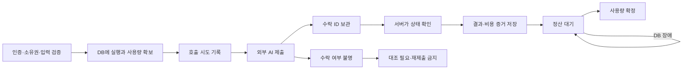

# 상용화 전 사용량·생성 정산·접근 경계 개선 설계

작성: 2026-09-11 KST

상태: 코드·EC2 내부·운영 DB 핵심 함수/권한 읽기 확인 완료 / 운영 정책·일부 출시 검증 미완료 / 구현 전

대상: `fixup-image-agent`; 최초 리뷰 `0d7077e`, 운영 재확인 시 로컬 HEAD `57e9bee`, 현재 작업 파일 별도

**최신 확인은 §18이 우선한다.** 최초 조사에서 막혔던 SSH와 Supabase 접근은 해결됐고, 실제 운영 기본 quota·단가·리전·RLS까지 확인했다. 아래 최초 조사 이력의 ‘확인 대기’와 중간 단가를 현재 상태로 읽지 않는다.

## 1. 목적과 판단 범위

이미지를 만든 요청, 사용자가 소비한 크레딧, 제공자에게 발생한 비용을 서버가 끝까지 연결한다. 시간 경과·브라우저 종료·중복 요청·정산 오류·사용자 입력 변경 때문에 차감이 사라지지 않아야 한다. 운영자가 정한 예산을 고객이 늘릴 수 없어야 한다.

이 문서는 독립 코드 리뷰와 Claude 리뷰 재검증 결과를 구현 가능한 계약으로 바꾼다. 아직 수정·마이그레이션 적용·배포를 수행하지 않았다. 이 항목들을 구현하면 바로 상용화 인증이 되는 것은 아니다. §15의 실제 DB·운영 검증을 통과해야 제한된 공개 운영을 판단할 수 있다. 결제상품·세금·약관 설계는 이번 범위가 아니다.

‘예약’은 지정 시각에 실행하는 제품 기능이 아니다. 예상 크레딧을 임시 확보하는 내부 상태다. 사용자 화면에는 ‘생성 중 사용량’으로 설명한다. 생성 예약·게시 예약 기능은 추가하지 않는다.

### 1.1 최초 조사 근거 수준 — 후속 운영 확인은 §18

| 구분 | 이번에 확인한 사실 | 확인하지 못한 것 |
|---|---|---|
| 로컬 | `master@0d7077e`; 생성·정산·권한·배포 코드와 SQL | 운영과 같은 코드인지 |
| GitHub | `625f8124c102a1d162744d9ca67e3fe0b81206d1` 빌드 실행 `34556177200` 성공 | 그 릴리스가 실제 배포됐는지 |
| 최신 원격 차이 | `0d7077e...625f8124` 비교: 리디자인 파일 선택·요청 식별 UI와 테스트 변경 | 다음 구현 시점의 추가 변경 |
| 공개 운영 | GitHub 공개 변수의 사이트는 `http://54.180.68.212`; 2026-09-11 11:56 KST `/login` HTTP 200, HTTPS 리다이렉트 없음; Caddy 경유 | 별도 도메인·TLS 존재 여부, 실제 Caddy 버전 |
| readiness | 같은 시각 `/api/health/ready` 200, 네 설정 검사 true | DB 연결·RPC 버전·정산 처리기 생존 여부 |
| 로컬 환경 | `apps/web/.env.local`의 Supabase 값은 의도적으로 비어 있고 LOCAL_STORE/LOCAL_AUTH_BYPASS 사용 | 로컬 화면으로 운영 RLS 확인 불가 |
| 관리 접속 | 기본 AWS 프로필의 서울 리전에서 위 IP 인스턴스 미조회; 발견한 키 하나로 해당 IP SSH 인증 실패 | 올바른 계정·키, systemd/current/메모리/SG/DB 적용 상태 |

공개 응답은 생성·로그인·DB 변경 없이 조회했다. 비밀값은 문서에 기록하지 않는다. AWS 미조회는 인스턴스가 없다는 뜻이 아니라 현재 계정으로 확인하지 못했다는 뜻이다. 사용자에게 올바른 관리 접속 경로를 요청했다. 이 정보가 오면 §14의 사전 점검 결과를 먼저 채우며, 미확인 값을 추측해 배포하지 않는다.

### 1.2 보존할 현재 작업

시작 시 `apps/web/next-env.d.ts`, `apps/web/tsconfig.json` 수정, `supabase/bootstrap_admin.sql` 삭제, 한글 이름의 수동 적용 SQL 여러 개와 이동된 bootstrap 파일이 있었다. 이 설계 작업은 이를 수정·삭제·정리하지 않는다. 구현은 당시 최신 코드와 별도 작업 브랜치에서 시작하고 기존 변경 소유권을 유지한다.

설계 검토 도중 별도 작업에 의해 `lib/credit-cost.ts`의 redesign-openai 값이 0.02→0.21, `redesign-core/src/generate.ts`의 품질이 high로 변경되고 `202609110002_redesign_high_quality_price.sql`이 추가됐다. 같은 시점 edit-section core는 아직 quality=low, web edit route는 고정 1 차감이었다. 진행 중 변경이므로 완성된 품질 정책으로 해석하지 않는다. **최초 리뷰의 ‘OpenAI 예약 1’은 현재 작업 파일에는 더 이상 해당하지 않으며, 현재 계산은 예약 5/차감 1이다.** 구현 시작 시 generate/edit 각각의 품질·가격·테스트를 재고정한다. 이 설계는 해당 변경 파일을 수정하지 않는다.

## 2. 기존 구조와 반드시 지킬 경계

| 영역 | 현재 구현 | 설계에서 유지·변경할 점 |
|---|---|---|
| 웹 | Next.js 15.5.24 standalone, Node 22, systemd, loopback 3000 | 런타임·호스팅 유지; 요청과 무관한 정산 실행 보완 |
| 프록시 | Caddy 템플릿 → `127.0.0.1:3000` | 공식 서비스 HTTPS origin 고정, 내부 처리 API 외부 차단 |
| 회원/장부 | Supabase Auth, profiles, generation_events | 기존 계정·월 한도·KST 월 기준 유지 |
| 저장 | Supabase `library` private storage; 로컬은 파일 모드 | 기존 결과 URL 열람 유지; 새 실행 결과는 회차별 저장 |
| 생성 | SNS/포스터는 fal queue, PDP는 기존 provider 경로, 리디자인은 OpenAI/Google 직접 호출 | 제공자·모델·이미지 보존 의미 유지; 호출 증거와 비용 기록 추가 |
| SNS | `startQueuedFlow`가 최초 제출; `pollQueuedFlow`가 회수와 다음 제출 | 한 실행 안 카드/칸 순차 생성 유지; 진행 주체를 서버로 이동 |
| 포스터 | `submitPoster`/`collectPoster`; 브라우저가 fal 식별자 전달 | 브라우저는 서버 run ID만 전달; 서버가 요청 연결 보관 |
| 로컬 | `lib/local-store/index.ts`, 운영 인증 우회는 production에서 차단 | 로컬 fake 흐름 보존; 운영 보안 검증은 별도 실제 PostgreSQL |
| 수집 | 별도 worker.mjs와 systemd; masked 허용 | 수집 재활성화 금지; 정산을 수집 워커에 넣지 않음 |
| 배포 | Linux CI 빌드 → GitHub release 자산 → EC2 current 전환 | Windows/EC2 빌드 금지 유지; DB 호환성·정산 heartbeat 검증 추가 |

`docs/DEPLOY.md`는 기존 상세페이지 서비스와 같은 Supabase를 사용한다고 한다. 반면 오래된 `docs/MEMBERSHIP_DEPLOYMENT.md`는 전용 DB·pending 승인·30장·다른 서비스 경로를 설명한다. 후자를 현재 운영 정본으로 사용하지 않는다. 실제 공유 여부가 확인될 때까지 **공유 DB로 취급**하고, 기존 공용 RPC를 전면 교체하거나 공용 profiles/Storage 정책을 일괄 변경하지 않는다.

`docs/DEPLOY.md`의 ‘새 표만 추가’ 지침으로는 이번 권한 수정이 불가능하다. 이 설계는 문제 해결에 필요한 자사 SNS/포스터 열 권한 변경을 명시한다. DB 변경 내역과 다른 소비 앱 호환성을 검토하지 않은 채 기존 일반 배포 절차를 실행해서는 안 된다.

## 3. 문제별 결정표

| ID | 확인한 문제 | 결정 | 수용 시험 |
|---|---|---|---|
| F01 | 만료 청소가 미완료 사용량을 failed로 바꾸고 finalize가 무시 | v2 실행은 시간만으로 차감 근거·확보분 제거 금지 | T01–T03 |
| F02 | 사용자 수정 가능한 data의 reservationId를 신뢰 | 서버 전용 run/event 연결, 실행 상태를 입력 JSON에서 분리 | T04–T06 |
| F03 | 포스터 project/request/fal/가격/예약 연결 미검증 | 서버 저장한 attempt로만 조회·회수·정산 | T07–T09 |
| F04 | 정산 오류 뒤 연결 삭제, 중복 회수 실패 | 영속 정산 대기 + 멱등 저장/정산 | T10–T12 |
| F05 | 팀장이 개인/팀 예산 증액·해제 | 이번 단계 개인/팀 총한도 쓰기는 admin만 | T13 |
| F06 | 팀 합계에 대한 동시성 보호 없음 | 동일 팀·사용자 예산 잠금과 원자적 확보 | T14–T16 |
| F07 | 다섯 LLM 경로 호출 제한/기록 누락 | 공통 admission·독립 호출 원가 기록; 무료 기능은 0크레딧 유지 | T17–T19 |
| F08 | 읽기 권한만 확인한 후 외부 비용 발생 | 비용 전에 소유권·현재 회원 상태·입력 검증 | T20 |
| F09 | 수정 정산 고정 1; Google 예약 3, 별도 변경 후 OpenAI 예약 5 | 실제 생성/수정 품질까지 포함한 시작 시 가격 snapshot으로 양쪽 계산 통일 | T21 |
| F10 | 내부 주소 검사의 역슬래시 우회 | 정규화 후 origin 일치 확인; 서버 redirect 공통화 | T22 |
| F11 | readiness 설정 상세 공개, 실제 정산 생존 미검사 | 공개 응답 최소화, 상세는 admin, 기능 readiness 추가 | T23 |
| F12 | CSP 없음, HTTP 서비스 경로 확인 | HTTPS 우선; CSP 보고 모드→검증→적용 | T24 |
| F13 | 비용 집계가 현재 단가표로 과거를 재계산 | v2는 호출 당시 가격과 측정 상태 보존 | T25 |

Caddy가 기본적으로 위조 X-Forwarded-Host를 그대로 전달한다는 Claude 설명은 채택하지 않는다. 공식 문서상 기본값은 해당 헤더를 재설정한다. origin을 설정값으로 고정하는 것은 프록시 신뢰와 리다이렉트 오류를 함께 줄이기 위한 변경이다.

## 4. 불변 조건

1. 유료 제공자 호출 전 인증·쓰기 권한·입력·예산 확인과 영속 호출 기록이 존재한다.
2. 사용자 입력의 `userId`, `teamId`, 비용, reservation ID, fal endpoint/ID를 정산 근거로 사용하지 않는다.
3. `(user_id, idempotency_key)`는 동일 실행을 식별한다. 같은 키/같은 입력은 기존 실행을 반환하고, 같은 키/다른 입력은 409다.
4. 한 사용자의 미완료 이미지 실행은 1개다. 한 실행 내부 병렬성은 해당 도구 정책을 유지한다. SNS는 순차, 기존 PDP batch 병렬은 별도 비용·용량 상한 아래 유지한다.
5. 10분은 작업 소실의 증거가 아니다. lease 만료는 다른 서버가 이어받을 조건이며 크레딧 해제 조건이 아니다.
6. 사용자 크레딧과 제공자 원가는 별도 값이다. 실패 비용·QA 재시도 비용을 0원으로 숨기지 않는다.
7. 확정 성공은 정확히 한 번 반영한다. 같은 결과 재회수·같은 정산 재호출은 금액과 이미지 수를 늘리지 않는다.
8. 외부 수락 여부 불명은 `unknown`이다. 성공·실패를 지어내거나 같은 요청을 무조건 재제출하지 않는다.
9. 실행 시작 당시 사용자·팀·KST 월·가격을 고정한다. 팀 이동·월 변경·가격 변경으로 과거 실행을 다른 장부로 옮기지 않는다.
10. 정책 거절은 외부 호출 0회다. 서버 DB 연결 실패도 새 유료 호출을 허용하지 않는다.

## 5. 데이터 모델

기존 `generation_events`는 회원 사용량 장부로 유지한다. 서버 전용 실행/호출 기록을 보완한다. 아래는 **새로 만들 설계**이며 현재 존재한다는 뜻이 아니다.

### 5.1 `generation_runs` — 사용자 동작 한 번

| 열 | 형식/계약 |
|---|---|
| id | uuid PK, 서버 생성 |
| user_id | uuid, 로그인에서 확정; cascade로 미정산 증거 삭제 금지 |
| team_id_snapshot | 시작 당시 팀; 이후 팀 이동과 무관 |
| operation, protocol_version | 작업 종류, 새 실행은 2 |
| idempotency_key, input_hash | 사용자별 unique key, 정규화된 유효 입력 hash |
| event_id | generation_events.id unique FK; 0크레딧 LLM도 이벤트 생성 |
| resource_type, resource_id | sns/poster 등 소유권 확인한 대상; polymorphic FK 대신 시작 RPC에서 실재·소유자 확인 |
| execution_snapshot | 서버 검증된 입력/계획·선택 카드·가격 버전; 임의 원본 JSON 복사 금지 |
| checkpoint | 서버 전용 진행 상태; UI projection과 분리 |
| state | prepared / running / collecting / settlement_pending / succeeded / failed / cancelled / needs_reconciliation |
| stop_requested_at | 다음 외부 제출을 멈추라는 명령; 진행 중 작업의 결과 소거 아님 |
| lease_token, lease_epoch, lease_until | 작업자 점유/세대; 만료와 크레딧 해제는 무관 |
| next_check_at, attempt_count | 조회·복구 지연 관리 |
| result_manifest | 소유자가 재조회할 수 있는 서버 결과 위치; 원본 이미지/base64를 장부 JSON에 넣지 않음 |
| created_at, updated_at, settled_at, error_code | 시간/안전한 오류 코드 |

새 표는 RLS 활성화, PUBLIC/anon/authenticated 모든 직접 권한 회수, service_role만 접근. 사용자에게 보여줄 실행 상태는 기존 API가 소유자/팀 읽기 정책으로 필드를 골라 반환한다. raw snapshot·내부 오류·lease·원가 계측 세부는 일반 응답에 포함하지 않는다.

활성 이미지 실행 unique 조건은 prepared/running/collecting/settlement_pending/needs_reconciliation이며 0크레딧 여부로 분류하지 않는다. 이미지 비용이 실수로 0으로 계산돼도 동시 제한을 우회하지 못한다. LLM 실행은 별도의 동시 제한을 쓴다.

### 5.2 `generation_attempts` — 제공자 호출 한 번

| 열 | 형식/계약 |
|---|---|
| id, run_id, sequence, logical_step | PK, run FK, 실행 내 단계·시도 unique |
| provider, model, endpoint | 서버 허용 목록에서 선택, 실행 후 불변 |
| state | prepared / submitting / submitted / result_ready / stored / failed / unknown / cancelled |
| provider_request_id | 수락 직후 기록; 가능한 경우 `(provider, endpoint, provider_request_id)` unique |
| submitted_at, completed_at | 제공자 호출 생명주기 |
| request_hash, output_manifest | 실행 입력/결과 대응; 저장 manifest에 크기·MIME·digest 포함 |
| requested_images, returned_images, delivered_images | 생성·회수·사용자 제공 장수 분리 |
| price_snapshot | 모델·크기·모드·계산식 버전·당시 단가·fallback/QA 상한 |
| input_tokens, output_tokens, metering_state | observed / estimated / unknown; 사용량이 없으면 0으로 확정하지 않음 |
| estimated_cost_microusd, measured_cost_microusd | bigint 또는 NUMERIC 정수 마이크로달러; unknown은 NULL |
| billable_state | pending / estimated / reconciled / unknown; 업체 청구서 대조 전 ‘실제 청구 확정’으로 표시 금지 |

SNS/포스터 기존 request 표에는 nullable `run_id`, `attempt_id`를 추가하고 v2 쓰기는 FK/unique로 연결한다. 이 표는 기존 조회 호환용이며 v2의 두 번째 원가 정본이 아니다. 하나의 트랜잭션 RPC에서 attempt와 기존 표 projection을 갱신한다. 기존 데이터는 삭제하지 않는다.

포스터 요청 행은 **제출 전에** 만든다. 현재 `requestInsertRow`는 fal ID를 저장하지 않고 완료 시에야 기록한다. 새 계약은 사전 행 → submitting → 수락 ID 기록 순서다. 요청이 어느 프로젝트의 어느 회차인지 확정 없이 collection을 시작하지 않는다.

### 5.3 기존 장부의 호환 확장

- `generation_events.protocol_version smallint NOT NULL DEFAULT 1` 추가. v2는 begin RPC가 2를 명시한다.
- v2 event는 기존 status 3종을 유지한다. run이 미해결이면 event는 reserved다. 상세 진행 상태는 run에 둔다.
- `expires_at`은 구형 실행에서만 해제 집계 의미를 가진다. v2 집계는 run/settlement 상태로 판단한다.
- `requested_units`와 `consumed_units`의 현재 60 상한 계약을 조용히 늘리지 않는다. 시작 전 최대 필요량이 이를 넘으면 기존과 같이 거절한다. 모델/카드 수 정책 변경은 별도 제품 결정이다.
- v2 원가는 attempt 합계, v1 원가는 기존 계산으로 읽되 화면에 추정 기준을 구분한다. v2를 기존 `billable_images × 최신 model_prices`와 이중 합산하지 않는다.
- 과거 확정 event의 소비량을 이 설계 때문에 소급 변경하지 않는다. 수동 보정이 필요하면 사유·운영자·증거가 있는 별도 감사 기록으로 남긴다.

### 5.4 비용 방어·감사·heartbeat 저장

- `usage_controls`: 단일 서버 전용 정책 행. `admission_enabled`, `daily_cost_limit_microusd`, `unresolved_exposure_limit_microusd`, `policy_version`, `updated_by`, `updated_at`. 제한 값은 양수 또는 미설정 NULL이며 NULL은 개방 불가다. authenticated 직접 수정 불가.
- `usage_budget_days`: KST day PK, `committed_cost_microusd`, `reserved_cost_microusd`. begin/provider attempt 준비와 결과 기록 시 control→day 잠금 순서로 갱신한다. 청구가 미확인인 경우 추정 지출로 표시한다. attempt별 전이와 같은 트랜잭션에서 증감하여 중복 결과로 이중 해제하지 않는다.
- 오래된 unresolved 노출은 attempt 합계에서 계산하거나 검증 가능한 counter로 유지한다. `usage_budget_days`의 오늘 행만 검사해 전날 unknown을 잊지 않는다. 비용 일자는 실제 provider 제출 KST 일자를 고정한다. 일자 경계를 넘겨 아직 제출하지 않은 prepared attempt는 제출 직전에 그날 예산을 다시 확보하고 이전 확보분을 원자적으로 이전한다.
- `usage_audit_events`: 서버 전용 append-only 기록. quota/수동 대조/중단선 변경의 actor·target·before/after·reason·증거 식별자·시간을 저장한다. 통상 앱 코드에는 UPDATE/DELETE 경로를 만들지 않는다.
- `generation_executor_health`: 실행기 식별자·release/protocol·최근 successful tick·최근 오류 분류. 작업이 없어도 정상 빈 tick은 heartbeat를 남긴다. 초기 stale 기준 5분, 오래 걸리는 단계도 heartbeat를 갱신하며 해당 기준은 부하 시험에서 확인한다.
- 인덱스: runs `(next_check_at, created_at)` 비종료 partial, `(user_id, idempotency_key)` unique, resource별 active index; attempts `(run_id, logical_step, sequence)` unique, `(state, submitted_at)`. 개인정보/원가를 일반 API 조회에 노출하지 않는다.

## 6. RPC·트랜잭션·동시성

### 6.1 새 RPC 계약

모두 `SECURITY DEFINER`, 고정 search_path, 스키마 명시, PUBLIC/anon/authenticated EXECUTE 회수, service_role만 실행한다. 서비스 서버가 실제 사용자 인증을 완료한 뒤 actor를 넘긴다. 클라이언트 전달 actor를 사용하지 않는다.

| RPC(신규) | 원자적 처리 |
|---|---|
| begin_generation_v2(actor, key, operation, verified_input, hash, price) | 중복 확인→권한/회원 상태 재확인→예산/호출 제한→run/event/초기 attempt 생성 |
| claim_generation_run(run_id?, lease_seconds) | 실행 1개 선택/점유, lease_epoch 증가; SKIP LOCKED로 다른 처리자 충돌 방지 |
| advance_generation_attempt(run, attempt, lease, expected_state, patch) | 조건부 상태 전이, 증거/projection 저장; 오래된 lease 쓰기 거절 |
| settle_generation_v2(run_id, lease) | 서버 증거로 소비량 계산→event 확정→run 확정→예산 확보분 해제→projection 갱신 |
| request_stop_generation(actor, run_id) | 소유자 확인 후 stop_requested_at 설정; 금융 정산 수행 아님 |
| set_usage_quota_v2(actor, target, value, reason) | admin 확인, 같은 예산 잠금, before/after 감사 기록 |

정산 RPC는 브라우저가 정한 success/consumedUnits를 받지 않는다. 필요한 모델별 산식은 검증된 price snapshot과 출력 증거에만 적용한다. TypeScript가 계산한 값도 DB가 범위와 증거를 검증한다. 중복 terminal 정산은 기존 결과를 반환한다. 기존 증거와 다른 정산 시도는 409/감사 로그이며 덮어쓰지 않는다.

### 6.2 잠금 순서

예산에 영향을 주는 begin/settle/quota/팀 이동은 동일 순서를 따른다.

1. 전역 제공자 비용 예산 행을 갱신한다면 그 행을 먼저 잠근다.
2. 영향받는 팀 ID들을 정렬해 transaction advisory lock을 잡는다.
3. 영향받는 사용자 ID들을 정렬해 같은 방식으로 잠근다.
4. profiles/실행/event 행 잠금 후 값을 다시 읽고 검사한다.

팀 소속은 잠금 전에 읽어 후보를 정하되, 사용자 잠금 후 다시 확인한다. 달라졌으면 트랜잭션을 재시도한다. 팀 편성/한도 액션도 같은 RPC 프로토콜을 사용해야 한다. 단순히 예약 함수 한 곳에 team lock을 넣고 기존 무잠금 team_members update를 남기지 않는다.

외부 API·Storage 업로드 동안 DB 트랜잭션을 열어 두지 않는다. lease는 영속 실행의 소유권이며 DB 트랜잭션 잠금과 별개다. 짧은 claim/advance 트랜잭션에 fencing token을 적용한다. stale 작업자는 새 제출을 하지 못한다.

### 6.3 한도 계산

- 개인: 현재 KST 월의 소비 완료 + 해당 월의 미해결 확보 + 새 확보 ≤ profiles.monthly_quota.
- 팀: 해당 팀 snapshot으로 기록된 현재 KST 월의 소비/미해결 확보 + 새 확보 ≤ teams.monthly_quota. 팀 0은 기존처럼 팀 제한 없음이되 admin만 설정한다.
- 개인 사용량과 팀 사용량을 독립 검사한다. 다른 팀에서 쓴 개인 사용량을 새 팀에서 쓴 양으로 중복 계산하지 않는다.
- 다른 달에서 시작한 미완료 이미지 run도 동시 실행 제한에 포함한다. 월이 바뀌었다고 기존 외부 작업을 잊지 않는다.
- 월말 생성의 소비는 시작한 월에 기록한다. 현재 월 사용량 응답과 과거 월 정산 결과를 혼동하지 않는다.
- 한도를 현재 사용량 아래로 내리는 것은 과거 소비를 취소하지 않는다. 새 실행만 거절한다.

### 6.4 공유 DB와 v1 함수

v2만 안전하게 만들고 기존 예약 RPC가 v2 event를 만료 정리하도록 남겨두면 실패한다. 적용 전 실제 공용 함수 정의를 추출하여 최소 호환 패치를 작성한다.

- v1 만료 청소는 `protocol_version = 1`만 대상으로 한다.
- v1 사용량/동시 실행 집계도 v2의 미해결 확보분을 포함한다. `expires_at > now()`만으로 v2를 제외하지 않는다.
- v1 예약·정산과 v2가 같은 사용자/팀 예산 잠금 규약을 따른다.
- v1의 이름·인자·반환 열은 보존한다. 다른 앱의 RPC 계약을 깨지 않는다.
- 이전 앱은 JSON 기반 실행을 만들 수 있으므로 **동일 SNS/포스터 표에 쓰는 모든 앱의 버전**을 확인한다. 공용 함수를 패치할 수 없거나 다른 소비 앱을 검증할 수 없으면 혼합 운영을 하지 않는다. 공유 사용량 전체의 한도 보장을 선언할 수 없기 때문이다.

## 7. 실행과 정산 상태 전이

### 7.1 실패 지점별 처리

| 실패 지점 | 처리 | 새 외부 제출 |
|---|---|---|
| 유효성/권한/예산 거절 | 요청 거절, 외부 호출 없음 | 없음 |
| attempt 기록 전 DB 장애 | 503; 준비되지 않은 호출 실행 금지 | 없음 |
| 기록 후, 호출 전 프로세스 종료 | lease 회수 후 실제 submitting 전이 여부 확인 | prepared가 확실한 경우만 |
| submitting 이후 네트워크 단절 | 수락 여부 unknown; 자동 실패·환불 처리 금지 | 재제출 금지 |
| 수락 ID를 받은 뒤 DB 기록 실패 | 서버 전용 복구 journal에 ID/run/attempt 최소 기록 후 DB 재기록 | 재제출 금지 |
| fal 상태/결과 조회 실패 | 같은 ID 조회 재시도; 명시적 provider failure와 통신 오류 구분 | 재제출 금지 |
| Storage 저장 실패 | 같은 결과 재회수/같은 회차 경로 저장 재시도 | 재생성 금지 |
| 저장 후 정산 실패 | settlement_pending 유지, 동일 증거로 재시도 | 재생성 금지 |
| 응답 전송 실패 | 같은 idempotency key로 저장된 결과 반환 | 재생성 금지 |

외부 제공자 수락과 DB commit 사이를 단일 트랜잭션으로 묶을 수는 없다. ‘exactly once 외부 호출’을 보장한다고 쓰지 않는다. fal request ID를 얻기 전에 프로세스가 죽은 경우는 journal로도 해결되지 않는다. 공식 제공자의 검증된 idempotency/reconciliation 기능이 없으면 unknown으로 남기고 운영자 대조를 요구한다. 신규 제출은 차단하며, 임의의 지연 후 자동 재제출하지 않는다.

복구 journal은 기존 systemd `StateDirectory` 아래 전용 하위 경로에 append+fsync한다. 비밀키·프롬프트·이미지는 쓰지 않는다. user/run/attempt/외부 ID와 오류 분류만 보관한다. journal 실패도 기록하고 미해결 run은 유지한다. EBS 자체 장애를 해결해 주는 수단은 아니며 운영 DB가 정본이다.

### 7.2 멱등 저장

- 포스터는 기존 `(generation_request_id, variant_index)` unique를 활용한다. 재회수 시 insert 오류로 끝내지 않고 같은 digest/manifest면 기존 행 반환, 다른 결과면 conflict로 보류한다.
- SNS 새 생성물은 `{user}/sns/{project}/{run}/{card-or-slot}` 회차 경로로 저장한다. 기존 `{user}/sns/{project}/{card}` 파일과 URL은 계속 읽는다. 이후 projection만 새 회차를 가리키게 바꾼다.
- Storage 저장과 PostgreSQL은 원자적이지 않다. 파일 업로드 후 row commit 실패는 같은 경로·digest로 재시도한다. 사용자가 보고 있는 옛 결과를 미완료 새 실행으로 덮어쓰지 않는다.
- 사용자 결과 제공 기준은 서버에 결과가 보관됐는지다. 브라우저가 수신 확인을 하지 않았다는 이유로 무료 처리하지 않는다.

### 7.3 취소·삭제·편집

- SNS 중지는 새 카드/칸 제출을 막는다. 이미 제출한 요청은 같은 ID로 결과/실패를 확인한다. 지금 구현의 ‘회수도 중단하고 즉시 정산’은 제거한다.
- provider cancellation API는 현재 어댑터에 없다. cancel 요청 200만으로 무비용 실패라고 간주하지 않는다. 지원을 붙이더라도 최종 상태 확인 전 확보분 유지.
- 실행 중 프로젝트 삭제는 409로 막고 먼저 중지를 요청하게 한다. 화면 밖의 직접 DELETE도 동일하게 막는 DB 보호가 필요하다. 실행과 장부는 프로젝트 FK cascade로 잃지 않는다.
- 실행 중 본문 편집은 다음 실행의 draft만 바꾼다. 현재 실행은 immutable snapshot 사용. 새 실행은 이전 run terminal 이후 허용.
- 같은 프로젝트의 기획/캡션/이미지 결과 쓰기도 revision 조건부 갱신으로 보호한다. 늦게 끝난 옛 LLM 응답이 새 draft/새 실행 결과를 덮어쓰지 않는다. 충돌한 유료 응답의 비용은 기록하고 결과는 해당 run에서만 보관한다.
- 정지된 회원·팀 이동·프로젝트 보관 시 기존 외부 결과 회수/정산은 계속할 수 있다. 추가 유료 제출은 현재 active/소유권/stop 여부를 다시 확인한다.
- 계정 삭제로 미정산 장부를 cascade 제거하지 않는다. 활성 run 해소 전 계정 파괴 삭제를 막는 운영 절차/DB 조건을 둔다. 기존 탈퇴 정책 변경은 해당 경로 확인 후 적용한다.

## 8. 서버가 브라우저 없이 진행하는 방법

### 8.1 선택: 기존 Next 런타임 + 독립 systemd timer

새 Redis/SQS/별도 EC2를 도입하지 않는다. 운영 문서상 메모리 제약이 있고, SNS 결과 조립은 Next 안의 sharp·폰트·Storage 모듈을 사용한다. 수집 워커는 masked일 수 있다. 따라서 생성 실행은 DB에 남기고 **별도 timer가 기존 Next의 내부 처리 API를 호출**한다.

새 파일 계획:

- `apps/web/app/api/internal/generation/tick/route.ts`
- `apps/web/lib/generation/{coordinator,run-store,attempt-store,settlement,policy}.ts`
- `deploy/ec2/generation-tick.mjs` — Node 내장 fetch로 loopback 호출
- `deploy/ec2/fixup-image-agent-generation-tick.service`
- `deploy/ec2/fixup-image-agent-generation-tick.timer`

timer 초깃값은 완료 후 5초(`OnUnitInactiveSec=5s`), 한 tick은 한 실행의 짧은 단계만 진행한다. fal queued 상태를 기다리는 sleep으로 웹 요청을 오래 점유하지 않는다. due 순서로 조회하고 같은 실행을 계속 독점하지 않는다. 제출 준비의 LLM은 단계별 checkpoint, 호출 최대 120초, tick 150초, 로컬 클라이언트/oneshot timeout 180초, lease 210초를 **초기값으로 제안**한다. 결과 변환이 이를 초과하면 다음 단계로 나누며, 운영 메모리 측정 없이 병렬 처리 수를 늘리지 않는다.

lease 초과 직전 새 provider 호출 시작 금지. 실행 중 호출이 timeout되어도 작업을 재제출하지 않는다. 동일 tick 요청이 겹치거나 timer를 복수 서버에서 실행해도 DB claim/fencing으로 결과가 중복되지 않아야 한다. provider 조회만 재시도 가능하다.

인프라 내부 확인 전 별도 Node 상주 worker가 필요하다고 단정하지 않는다. 이 timer 방식의 처리 지연/메모리 수용 시험 실패 시 자원 계획을 다시 판단한다. 처음부터 복수 인스턴스를 전제한 인프라 증설은 범위 밖이다.

### 8.2 내부 API 보안

- Caddy의 `/api/internal/*`는 외부에서 404. 실제 프록시 접근 시험 필요.
- 내부 route는 별도 `GENERATION_TICK_SECRET`을 상수시간 비교하고, 운영에서 비어 있으면 503. Host/X-Forwarded-*로 내부 요청임을 판정하지 않는다.
- secret은 root 관리 env 파일에서 읽으며 URL·프로세스 인자·로그·GitHub 빌드에 넣지 않는다. tick helper가 Authorization 헤더를 설정한다.
- Next middleware는 이 경로를 사용자 쿠키 검사보다 먼저 내부 인증 코드로 넘긴다. route 자체 인증을 생략하지 않는다.
- background store는 `createSupabaseServerClient()`나 cookies에 의존하지 않는다. 기존 `sns/runtime.ts`의 세션 기반 쓰기는 actor가 확정된 서비스용 adapter로 분리한다. admin client를 쓰기 전에 run/프로젝트 소유자를 서버 DB에서 검증한다.
- tick은 임의 user/run payload로 실행할 대상을 바꾸지 못한다. 서버 DB에서 due 실행을 고른다.

### 8.3 브라우저/API 계약

| API | 새 계약 |
|---|---|
| SNS generate / 카드 재생성 | 검증+영속 begin 후 `{runId, state}` 반환; 서버 진행 |
| SNS status | 읽기 전용 projection/실행 상태 조회; 다음 제공자 제출 금지 |
| SNS stop | 소유자만 stop 명령 기록; 즉시 예약 삭제/실패 정산 금지 |
| 포스터 generate/edit | 소유권·입력 검증 후 run 생성; 응답 runId |
| 포스터 status | runId로만 서버 기록 조회; fal 식별자·단가 입력 사용 금지 |
| 중복 생성 key | 동일 hash는 같은 run 반환; 다른 hash는 409 |
| 미정산 결과 | 결과 열람 가능, usage 상태는 ‘처리 중’; 소비 0 확정처럼 표시하지 않음 |

구형 포스터 요청 body는 제한된 호환 기간에 서버 row로 역매핑할 수 있다. user/project/provider ID/endpoint가 모두 DB 기록과 일치할 때만 읽기 응답한다. 검증할 서버 증거가 없으면 409 `reload_required`. 클라이언트 값을 새 정산 근거로 채워 넣지 않는다.

## 9. 동기 API도 정산에서 빠뜨리지 않는다

대상은 PDP analyze/plan-from-text/key-visual/images/batch, characters/views, redesign generate/edit, 포스터 plan, 다섯 미계량 LLM 경로다. 실제 `reserveAiUsage`·provider 호출 전수 목록을 구현 단계에서 테스트 목록으로 고정한다.

- 기존 동기 응답/이미지 결과 모양은 유지한다. 호출 전 run/event/attempt 생성, 각 제공자 결과 수신 직후 증거/결과 저장, 그다음 정산한다.
- `settleAiUsage`에서 실패를 삼키더라도 영속 settlement_pending과 결과 manifest가 있어야 한다. 메모리 변수만 남긴 상태로 200 반환하지 않는다.
- PDP batch는 섹션별 성공/실패·QA 추가 생성 장수를 각각 기록한다. 사용자 차감은 현재 성공분 정책, 원가는 실패/QA까지 분리 보존한다.
- 리디자인 core와 PDP provider에는 SDK나 DB 클라이언트를 직접 넣지 않는다. `beforeProviderCall`, `afterProviderResult`, `onProviderFailure` 훅/실행 context를 주입하고 web adapter가 기록한다. DB 기록 없이 유료 호출로 넘어가는 경우를 테스트로 막는다.
- 직접 OpenAI/Google 호출이 응답 전에 프로세스 종료하면 자동 복구 가능한 원격 ID가 없을 수 있다. 이 경우 unknown, 자동 재시도 금지, 운영자 대조. ‘동기라서 반드시 실패했고 돈이 안 나갔다’는 판단 금지.
- 응답용 이미지 결과는 기존 사용자 소유 Storage에 서버 회차 경로로 보관하고 동일 key 재조회에 사용한다. 결과 보관 기간·삭제는 기존 라이브러리 정책과 맞춘다. 이번 설계가 기존 사용자 파일을 자동 삭제하는 정책을 만들지는 않는다.
- edit-section 성공 차감은 시작 시 실제 quality/size/mode를 포함한 price snapshot과 deliveredCount로 계산한다. 최초 리뷰 기준은 OpenAI 1/Google 3이었으나 동시 작업의 새 OpenAI 공통 단가로는 5다. generate의 high 단가를 여전히 low인 edit에 무조건 적용하지 않는다. 두 경로의 실제 품질 정책이 확정된 뒤 각자의 가격 fixture를 고정한다. 단가나 품질을 이 설계 작업에서 임의 변경하지 않는다.
- 성공한 provider 호출과 정산 오류를 서로 다른 try/catch 단계로 분리한다. finalize가 던졌다는 이유로 바깥 catch가 이미 성공한 요청을 `success=false, 0`으로 다시 정산하는 구조를 남기지 않는다.

## 10. 접근 권한과 입력 경계

### 10.1 비용 전 쓰기 권한

`assertOwnedSnsProject`, `assertOwnedPosterProject` 공통 guard를 도입한다. 실제 actor와 프로젝트 user_id 일치를 확인한다. 팀 공유 SELECT는 그대로 두되 생성·기획·캡션·검수·중지·수정은 소유자만 허용한다. admin의 전체 조회 권한을 생성 대행 권한으로 확대하지 않는다.

스토리지 경로는 사용자가 넣은 data의 assetPath를 그대로 admin 서명/읽기하지 않는다. 허용된 reference/image 행을 소유권 또는 팀 공유 정책으로 읽고 그 행의 canonical 경로를 사용한다. 검토한 `refreshProjectAssetUrls`가 mutable JSON 경로를 서명하는 점도 실행 입력 분리와 함께 다룬다. 세션에서 해당 project를 읽었다는 사실만으로 내부 모든 경로를 신뢰하지 않는다.

### 10.2 JSON/열 권한

- SNS/포스터 `data`에 금융·실행 정본을 두지 않는다. run checkpoint로 이동한다.
- 자사 프로젝트의 data/status와 SNS 카드의 asset_path/status/review/error 등 서버 결과 열 직접 UPDATE 권한을 회수한다. draft 편집은 스키마가 정한 API 명령으로만 수행한다.
- 현재 세션 클라이언트로 이 열들을 쓰는 저장소는 소유자 검사를 갖춘 server adapter로 전환한 뒤 GRANT를 회수한다. 순서를 뒤집으면 정상 편집이 전부 실패한다.
- 사용자에게 남길 title/copy 등의 직접 수정도 실행 snapshot에는 소급 적용하지 않는다. 새 실행에서 입력으로 검증한다.
- 생성 중 직접 DELETE 보호, service_role bypass 뒤의 소유권 검증, Storage 다른 사용자 경로 주입을 실제 authenticated 역할로 시험한다.

### 10.3 팀 예산 정책

이번 수정은 새 팀 배분 모델을 만들지 않는다. `setPersonalQuotaAction`, `setTeamQuotaAction`을 admin 전용으로 변경하고 `/team` 크레딧 입력 UI도 admin에게만 연다. 팀장 승격/팀 편성 기능은 유지하되 그 권한으로 예산 쓰기를 얻지 못한다.

`/admin`의 기존 개인 한도 변경도 새 감사/잠금 RPC를 사용한다. before/after/actor/time/reason 기록. 한도 숫자를 자동 인상·인하하거나 기존 팀의 0을 일괄 유한값으로 바꾸지 않는다. 운영 예산을 채우는 과정은 배포 전 표로 검토한다. 팀장이 예산 안에서 배분하는 기능은 이번 문제를 막는 데 필수가 아니므로 추가하지 않는다.

## 11. LLM 비용과 남용 제한

### 11.1 호출 제한은 이미지 크레딧과 별개

새 operation: `redesign_transcribe`, `sns_plan`, `sns_caption`, `layout_analyze`, `poster_review`. 기존 `pdp_analyze`와 `poster plan`의 현재 분류도 추적한다. operation 타입·DB check·RPC 허용 목록을 하나의 계약 파일/검증 시험으로 맞춘다.

이 다섯 기능에 새 사용자 요금을 부과하지 않는다. `requested_units=0`으로 유지하되 호출 수/입력/동시성/운영자 비용 예산은 검사한다. 현재 SNS 이미지 생성 시 더하는 기획 추정 크레딧을 중복 차감하지 않는다. 실제 호출 원가는 각 LLM attempt에 한 번만 적는다.

제안 초기 제한은 다음과 같다. 제품의 정상 플로우 시험에서 부족하면 수치를 명시적으로 조정하며, 무제한 fallback은 없다.

| 항목 | 초기값/기준 |
|---|---|
| PDP 기존 분석 | 기존 `ANALYZE_HOURLY_LIMIT` 기본 10/시간 유지 |
| 다섯 LLM 작업 | 사용자별 각 10/시간, 합계 30/시간 |
| LLM 동시 실행 | 사용자별 1; image run 내부 LLM도 같은 제한 계열에서 호출 비용 집계 |
| fallback | 현재 지원 fallback을 최대 1회로 명시; 호출별 attempt 기록 |
| 전사 입력 | 현재 최대 8 strips 유지; image decode 전 byte limit, decode 후 pixel limit 검증 |
| 입력 크기 | 기존 각 schema 한도를 조사해 유지; 무제한 필드에 바이트/문자/픽셀 상한을 추가하고 정상 최대 입력 fixture로 검증 |

호출 수는 승인된 run 기준 rolling hour, 실패·unknown도 포함한다. 정책 거절은 별도 거절 로그이며 AI 성공 횟수로 세지 않는다. 같은 key 재전송은 추가 횟수를 쓰지 않는다. 새 key를 계속 보내도 user 잠금 안에서 admission한다. 하나의 이미지 run 안의 카드별 프롬프트를 각각 ‘사용자 클릭 1회’로 세어 정상 카드 생성을 중간에 막지 않는다. 대신 provider call 수와 최대 비용 상한을 실행 계획에 포함한다.

### 11.2 원가 기록

기존 `withLlmMeter`, `recordLlmUsage`를 재사용하되 최종 합계만 메모리에 두지 않는다. provider adapter에서 각 응답의 모델/토큰을 attempt에 저장하고, fallback 성공 전 primary에 발생한 비용도 보존한다. 출력 파싱 실패도 provider 호출 증거와 분리한다. 사용량 필드가 없는 응답은 `unknown/estimated`, 0 확정 금지.

토큰×당시 단가는 추정 비용이다. 실제 provider invoice 대조와 구분한다. 월별 과거 원가가 현재 단가 변경으로 바뀌지 않아야 한다. 비용 표시에 ‘확인 안 된 호출 N건’이 보이며 합계에 미확인 비용이 없었던 것처럼 표현하지 않는다.

### 11.3 서비스 전체 비용 중단선

100크레딧 자동 활성화 계정을 여러 개 만들면 개인 한도만으로 서비스 지출을 제한할 수 없다. 실제 signup+Turnstile 작동 검증과 함께 운영자 전용 `usage_controls`에 전체 유료 호출 중단 스위치, 일 비용 예산, 미해결 비용 노출 상한을 둔다. 이 값은 배포 전 운영자가 정하는 비용 정책이며 현재 감당할 금액을 추측해 적지 않는다. 미설정 상태에서 상용 유료 호출 gate는 closed다.

provider 호출 전에 입력/출력 토큰·최대 이미지 수·QA/fallback 횟수·모델 크기에서 보수적인 최대 추정 비용을 확보한다. 반환 후 측정/추정값으로 대체한다. unknown은 확보분을 유지한다. 날짜가 바뀌어도 과거 미해결 비용 노출을 전역 상한에서 빼지 않는다. 실패했다고 원가 확보분을 0으로 풀지 않는다.

이 중단선은 **내부 추정 기반 비용 방어**이며 provider 청구액의 수학적 보증이 아니다. 최대 추정치를 만들 수 없는 모델/입력은 유료 요청을 허용하지 않는다. provider 자체 지출 제한이 있는지 운영 계정에서 확인하고, 없는 기능이 있다고 가정하지 않는다.

## 12. origin·HTTPS·health·CSP

### 12.1 origin과 리다이렉트

- production의 서버 redirect origin은 검증된 `NEXT_PUBLIC_SITE_URL` 하나를 사용한다. 프로토콜 https, 사용자정보/쿼리/fragment 없음, 예상 host 확인. 개발에서만 명시적인 localhost http 허용.
- `safeNext`는 역슬래시·제어문자·scheme-relative를 거절한 뒤 `new URL(next, canonicalOrigin)`을 만들고 origin이 같은지 확인한다. 반환은 pathname+search+hash만 한다. query의 디코딩 시점이 다른 `/auth/confirm`과 login을 함께 시험한다.
- `middleware.ts`, auth confirm, login, `selectProjectAction`의 `back` 등 모든 redirect 목적지를 공통 helper로 검증한다.
- canonical origin은 실제 DNS/TLS·Supabase redirect allow list·Turnstile hostname과 일치해야 한다. 값만 HTTPS로 바꾸고 운영 연결을 끊지 않는다.

### 12.2 현재 HTTP 경로

공개 HTTP 로그인 200은 실제로 확인됐다. 외부 상용 사용자에게 HTTP 세션을 허용하는 상태로 출시하지 않는다. 확정 도메인, DNS, Caddy 인증서, Auth redirect, Turnstile, CI 공개 변수, runtime 값을 한 배포 계획으로 맞춘다. 도메인이 아직 없으면 이 항목은 출시 게이트 미충족이다. Caddy 최신 기능을 추측해 IP 인증서 불가/가능으로 단정하지 않고 실제 설치 버전과 인증서 경로를 확인한다.

### 12.3 health 계약

- `/api/health`: 프로세스 liveness, 공개 200 최소 응답.
- `/api/health/ready`: 공개 `{ok,status}`만. 원래 배포 스크립트가 HTTP status만 검사하므로 호환 가능.
- 상세 설정/DB schema version/미정산 수/오래된 run/최근 tick 성공은 admin 전용 진단 API.
- liveness/readiness의 200과 AI 사용 가능 여부를 분리한다. generation begin은 schema version, 중단선, 처리기 heartbeat를 검사한다. 정산 처리기 장애 때 기존 결과 조회는 가능하되 새 비용은 발생하지 않게 한다.
- 배포 초기에 timer가 아직 heartbeat를 남기기 전 readiness를 통과하지 못하는 순환을 만들지 않는다. web 기본 readiness 후 timer 시작, generation readiness를 별도 검사하고 최종 배포 성공을 판정한다.
- 현재 generationReady는 GOOGLE+FAL 존재만 본다. 실제 주 기획 ANTHROPIC 및 fallback 설정을 기능별로 확인한다. 키 존재는 실제 provider 인증 성공과 구분한다.

### 12.4 CSP

처음에는 `Content-Security-Policy-Report-Only`. self, 실제 Supabase HTTPS/WSS, Turnstile, 사용 중인 image/blob/data 출처만 관측하여 허용한다. `'unsafe-eval'` 같은 광범위 허용을 임시 성공 조건으로 쓰지 않는다. Next inline script·정적 생성·Turnstile와 nonce/hash 적용 범위를 함께 검증하고, 정상 흐름 검증 후 enforce한다. 정적 페이지에 매번 nonce가 있다고 가정하지 않는다.

보고 endpoint는 body 크기/호출 제한을 두고 쿠키·토큰이 포함된 URL을 저장하지 않는다. CSP는 XSS 결함을 대신 고치는 수단이 아니며 origin/입력 검증을 선행한다.

## 13. 파일별 구현 범위와 순서

| 단계 | 주요 파일 | 완료 조건 |
|---|---|---|
| 0 현황 고정 | 본 문서, 실제 DB export, 운영 manifest | 서버/DB 공유 소비 앱 확인, 브랜치 기준 재고정 |
| 1 RED 시험 | `apps/web/lib/generation/__tests__`, disposable DB 통합 시험 | 만료/변조/중복/동시성 실패 증거 먼저 확보 |
| 2 DB 호환 기반 | 새 번호 migration, membership types/api/server | v1 보호, v2 schema/RPC/grants, 실제 SQL 시험 통과 |
| 3 권한·예산 | team/actions, admin/actions, teams/store, sns/poster stores | admin quota, 비용 전 소유권, 서버 필드 보호 |
| 4 비동기 실행 | sns queued-flow/runtime/settle, poster flow/stores, generation core, API clients | 브라우저 없이 진행/정산, runID 계약, 멱등 회수 |
| 5 동기·LLM | PDP/redesign/characters 경로, llm meter/provider adapters | 모든 유료 호출 사전 기록, 정산 복구, 원가·호출 상한 |
| 6 운영 연결 | internal tick route, systemd timer/helper, release packaging, health | masked collector와 독립 동작, 재시작 복구 |
| 7 웹 보안 | routes, middleware, auth confirm, Caddy, config | HTTPS/redirect/CSP 및 실제 브라우저 확인 |
| 8 출시 검증 | CI/배포/롤백 절차 | §15의 증거가 있는 승인 가능 상태 |

마이그레이션 번호는 구현 직전 최신 번호 다음으로 정한다. 기존 migration을 수정하지 않고 새 파일로 추가한다. 한글 수동 적용 파일을 migration replay 대상에 무작정 포함하지 않는다. `^[0-9]{12,14}_.*\.sql$` 같은 명시적 목록과 실제 적용 이력으로 정본을 정하며, 사용자 파일은 삭제하지 않는다.

로컬 모드는 신규 run/attempt repository를 파일 구현으로 제공하고 프로세스 재시작 후 재조회 계약도 맞춘다. 하지만 로컬의 파일 mutex는 운영 DB 잠금/RLS 검증을 대체하지 않는다. LOCAL_AUTH_BYPASS를 켠 시험 결과로 권한 시험을 통과 처리하지 않는다.

## 14. 운영 사전 점검·이행·롤백

### 14.1 운영 내부 확인 목록 — 완료 증거와 잔여 항목은 §18

접속 가능해지면 아래를 **읽기 전용**으로 확보한다. 비밀 env 원문·토큰·개인별 작업 내용은 보고서에 넣지 않는다.

1. 정확한 호스트/서비스: hostname, `readlink -f /opt/fixup-image-agent/current`, systemd web/collector 상태, 실행 Node 경로, release manifest/hash.
2. 프록시/망: 실제 Caddyfile과 import, 버전, listen 주소, HTTP→HTTPS, SG 3000 비공개. AWS 계정/리전이 맞는지 확인.
3. 자원: free/df, web RSS, OOM·재시작 횟수, 배치 처리 중 메모리. 문서의 911MB를 현재 측정값처럼 쓰지 않음.
4. env는 변수 이름과 존재 여부, 공개 origin, Supabase project ref만 기록. local bypass production 차단과 실제 값 충돌 점검.
5. DB: `pg_get_functiondef`의 reserve/finalize/summary, `pg_policies`, table/column grants, trigger/constraint, migration history. Auth email-confirm 자동 활성화 함수와 monthly_quota DEFAULT 확인.
6. 장부는 사용자 식별 없는 집계: 상태/operation별 건수, 만료 reserved, reservation_expired, 미확정 provider request, null 비용, project data 연결 유무/충돌 건수.
7. 공유 소비 앱: 같은 project ref와 RPC를 쓰는 서비스 목록/배포 버전. 다른 앱의 pending 작업과 사용량 화면 영향.
8. Supabase 백업/PITR·복구 가능 범위, Storage 백업/객체 보존, provider 예산 제한을 실제 설정으로 확인. 없으면 출시 게이트에 남긴다.

### 14.2 이행 순서

1. 별도 시험 DB에 현재 정본 migration을 replay한다. Supabase auth/storage 역할/스키마를 갖춘 환경을 사용한다. 현재 의도적으로 빈 로컬 Supabase env에 운영 키를 채우지 않는다.
2. 실패 재현→새 schema/RPC→v1 호환→새 앱을 순서대로 시험한다. 실제 v1 소비 앱을 포함한 mixed-version fixture를 실행한다.
3. 운영은 확장형 DB 변경부터 적용한다. event version 기본값 1, 새 필드는 nullable/기존 행 보존. destructive schema 축소는 이행 후 별도 단계다.
4. 호환 앱을 배포해 새로운 admission 중지 스위치, server-owned adapter, v1 drain 기능을 먼저 갖춘다. 아직 새 실행을 열지 않는다.
5. 기존 작업은 신뢰 가능한 provider request 기록으로 회수/정산한다. 클라이언트 수정 가능 JSON만으로 과거 과금을 확정하지 않는다. 소유자·요청 연결이 불확실하면 legacy reconciliation 목록으로 분리한다.
6. v1 활성 작업 0 또는 예외 목록의 운영자 처리 결정이 있어야 전환한다. 과거 만료 실패를 일괄 성공으로 바꾸거나 사용자에게 일괄 소급 차감하지 않는다.
7. 새 API/client와 timer를 같은 호환 버전으로 배포하고 grants를 강화한다. 무중단 혼합 쓰기가 안전하지 않으면 명시적 생성 점검 시간에 전환한다. 기존 결과 읽기는 유지한다.
8. schema·timer·예산 설정·HTTPS 검사 후 테스트 계정부터 v2 admission을 연다. 리디자인/PDP도 새 기록 계약 없이는 상용 gate를 열지 않는다.

### 14.3 배포 스크립트 수정 계약

- `prepare-ec2-release.mjs`가 tick helper를 앱 릴리스 안의 고정 경로(예: `ops/generation-tick.mjs`)로 복사하도록 한다. ops tar만 풀고 앱 current에 helper가 있다고 가정하지 않는다.
- systemd 유닛 설치는 root 관리 `/etc/systemd/system`, daemon-reload 포함. timer enable/start와 실패 처리 명시.
- 기존 collector masked 상태 보존. generation timer를 masked collector의 성공 여부로 판단하지 않는다.
- release 전환 전 새 admission을 닫고 실행 중 tick을 종료 대기한다. submitting 상태 강제 종료는 unknown 처리 대상이다. 강제 종료됐다고 확보분을 풀지 않는다.
- web 기본 health → timer start → heartbeat + schema protocol 확인 → admission 개방 순서.
- release manifest에 commit, schema min/max, protocol version, build run ID 포함. GitHub build 성공과 운영 current 성공을 별도 기록.
- 현재 verify/build는 병렬이고 release 자산이 verify 완료 전에 게시될 수 있다. 자산 존재만으로 배포하지 않는다. publish job을 verify/build 성공에 의존하게 하거나 배포기가 동일 SHA workflow 전체 성공을 강제 확인한다.
- 보안 감사 서버 timeout을 성공 감사로 기록하지 않는다. 제한된 공개 운영 전에는 성공한 의존성 검사 증거가 필요하다.

### 14.4 롤백

- v2 run이 하나라도 생성된 뒤에는 임의의 구형 앱으로 돌아가지 않는다. 롤백 대상은 v2 상태를 이해하고 새 admission을 닫을 수 있는 호환 릴리스로 제한한다.
- 급한 사고는 새 비용만 중단하고 읽기·회수·정산은 유지한다. old app으로 변경하며 DB 권한을 다시 넓히지 않는다.
- DB 테이블/장부를 drop해 되돌리지 않는다. 확장 schema 보존, 이전 앱의 지원 protocol 검증 후 current 전환.
- timer와 web은 같은 릴리스/protocol로 동작해야 한다. 롤백 후 기본 health와 generation heartbeat를 모두 검사한다.
- 다른 공유 DB 앱에 대한 v1 호환 패치는 새 앱 롤백과 함께 제거하지 않는다. v2 미해결 이벤트를 구형 만료 청소에서 보호해야 한다.

## 15. 검증과 출시 게이트

코드 문자열 검사만으로 통과할 수 없다. DB 역할·실제 두 연결 경쟁·실패 주입과 런타임 결과를 본다. 앞선 리뷰의 26파일/420개 기존 시험 통과는 아래 항목의 통과 증거가 아니다.

| 시험 | 시나리오와 기대 결과 |
|---|---|
| T01 | 10분 경과 후 다른 작업 begin → 기존 v2 확보분 유지, 무료 정산 없음 |
| T02 | 브라우저 완전 종료 → SNS 다음 카드/포스터 결과가 서버만으로 진행·저장·정산 |
| T03 | 외부 요청 장기 대기·월 변경 → 동시 제한 유지, 시작 월 정산 |
| T04 | authenticated REST로 project data/reservationId/실행 상태 변경 → 거절 또는 정산 정본에 영향 없음 |
| T05 | SNS 카드 asset_path/status/cost baseline 변조 → 서버 실행/정산 영향 없음 |
| T06 | 다른 사용자 storage 경로를 JSON에 주입 → 서명·읽기·외부 제출 전에 거절 |
| T07 | 포스터 A 프로젝트+B 요청+C fal ID 조합 → 외부 조회·저장·정산 0회 |
| T08 | 단가 조회 null/DB 오류 → 0원 확정 금지, 대조 상태 유지 |
| T09 | 같은 프로젝트의 이전 run status 호출 → 최신 run을 정산/종료하지 않음 |
| T10 | provider 수락 직후 DB 실패 → 중복 제출 0회, ID 복구 또는 unknown |
| T11 | 이미지 저장 후 정산 DB 실패→복구 → 결과 유지, 소비 정확히 1회 |
| T12 | 동시 status/tick, expired lease/stale 작업자 → 중복 이미지/차감/새 제출 없음 |
| T13 | 팀장 본인/타인/팀 0 설정/다른 팀장 승격 후 시도 → quota 수정 거절; admin만 감사 기록과 성공 |
| T14 | 팀 잔량 10, 서로 다른 사용자 8씩 동시 begin → 하나만 성공 |
| T15 | 두 사용자가 서로 반대 팀 이동·quota 변경·begin → deadlock 무한 대기 없음, 승인 예산 초과 없음 |
| T16 | 다른 팀 과거 사용·탈퇴·팀 보관·월 경계 → 개인/팀 합계 분리 일치 |
| T17 | LLM 종류별/합계/동시 상한 직전 두 요청 경쟁 → 한도 초과 provider 0회 |
| T18 | primary 사용량 발생+fallback 성공 / parse failure / usage 누락 → 모두 기록, unknown 구분 |
| T19 | 전역 비용 상한·중단선·heartbeat 끊김 → 새 비용 거절, 기존 정산 계속 |
| T20 | 팀원의 프로젝트 generate/plan/caption/review/stop → write 거절, 유료 호출 0회 |
| T21 | Google edit 성공 3크레딧; OpenAI는 실제 quality/size와 승인된 당시 단가로 계산(초기 1, 새 공통 단가 5). 고정 1 제거, generate/edit 품질 불일치 감지; 옛 run은 옛 snapshot 유지 |
| T22 | `//`, 역슬래시, 제어문자, encoded next, 악성 Host/forwarded-proto/back → 외부 redirect 없음 |
| T23 | 공개 health 상세 없음; tick 외부 접근 404·토큰 오류 거절; collector masked에서도 자동 정산 |
| T24 | HTTPS 강제·실제 가입/로그인/메일 확인/비밀번호 재설정·Turnstile·CSP로 정상 기능 유지 |
| T25 | 단가표 변경 전후 과거 원가 불변, 기존/v2 이중 집계 없음, 비용 미확인 건수 표시 |
| T26 | v1 reserve 호출이 v2 pending을 청소하지 않음; v1/v2 동시 사용도 공통 한도 유지 |
| T27 | stop 중 외부 완료·프로젝트 DELETE·suspended → 이미 발생한 비용 증거 유지, 새 제출 금지 |
| T28 | 배포/롤백 중 실행 + web 강제 재시작 → 복구 또는 명시적 unknown, silent refund 없음 |

실행 계층:

1. 순수 함수/상태 전이 unit tests: fake clock, model snapshot, 입력/권한 guard.
2. Supabase 호환 disposable DB integration: anon/authenticated/service_role, SQL migration 실제 실행, 둘 이상의 독립 DB 연결, 실제 transaction 경합. 운영 DB에 destructive fixture 금지.
3. fake provider + 실제 저장 계층 integration: 수락/응답 유실, 저장 실패, timer 재시작, 동일 key 응답 replay.
4. Linux CI: 기존 `pnpm test`, `pnpm typecheck`, 필요한 lint, release artifact sharp/font/helper 검증. 별도 integration job 필수이며 DB 연결 불가를 skip/pass 처리하지 않는다.
5. staging: 운영과 같은 Caddy/systemd/Next, collector masked, 브라우저 닫기, 재부팅/호환 rollback, 메모리 peak/처리 지연 측정.
6. 운영 최소 smoke: 예산이 제한된 테스트 회원으로 각 생성 경로와 정산 한 번씩, 운영자 ledger/제공자 기록 대조. 구현·배포가 승인될 때 실행하며 이번 설계 작업에서 유료 요청하지 않는다.

출시 게이트:

- [ ] 실제 DB 적용 함수/열 권한과 공유 앱 호환성 확인
- [ ] F01–F10 및 T01–T28 관련 필수 시험 성공
- [ ] 수락 불명/미정산 목록을 운영자가 찾고 처리할 수 있음
- [ ] HTTPS·Auth·Turnstile 실제 외부 경로 성공
- [ ] 운영자가 정한 전역 비용 중단선과 기본 quota 검토 완료
- [ ] heartbeat 장애 시 새 비용 차단, 복구 후 정산 성공
- [ ] 백업/복구 범위 확인 및 호환 rollback 실연
- [ ] 운영 메모리/디스크/동시 부하 수용 기준 충족
- [ ] 공급자 청구/내부 추정의 차이를 표시하고 적어도 테스트 호출을 대조

## 16. 설계 확정 전 남은 입력

| 항목 | 왜 필요한가 | 현재 처리 |
|---|---|---|
| EC2/DB 읽기 접속 | 실제 함수·GRANT·current·메모리·timer 설치 조건 | 해결: SSH와 Supabase 관리 API 읽기 성공. AWS SG·백업·부하 등 잔여 |
| 상용 canonical 도메인 | HTTP 공개 경로를 HTTPS/Auth/TLS로 전환 | 기존 IP를 몰래 새 도메인으로 대체하지 않음 |
| 전체 비용 한도 | 무료 체험·실패 비용까지 운영자가 감당할 예산 | 수치 미확정, 운영 개방 차단 조건으로 설계 |
| 공유 DB 소비 앱 목록 | 기존 reserve RPC 호환 패치의 영향 | 공유를 가정한 보수적 이행, 목록 확인 전 적용 금지 |

운영 내부와 DB 핵심 계약은 §18에서 확인했다. 다만 부하·복구·공유 소비 앱·운영 예산까지 검증된 최종 배포 설계는 아니다. 남은 운영 정책과 검증 결과를 확정한 뒤 출시 기준을 고정한다.

## 17. 근거 파일·외부 계약

로컬 주요 근거:

- `docs/superpowers/specs/2026-07-23-membership-db-admin-demo-design.md`: 10분 확보와 동시 1개 최초 계약.
- `supabase/migrations/202607230001_membership_usage.sql`, `202609070005_team_credit.sql`, `202609090001_reserve_operation_whitelist.sql`: 예약/정산/팀 집계.
- `supabase/migrations/202608310002_sns.sql`, `202608310004_poster.sql`: data·결과 열 권한과 결과 unique.
- `apps/web/lib/membership/api.ts`, `lib/sns/settle.ts`, `lib/poster/flow.ts`, `lib/poster/supabase-store.ts`: 예약 연결·예외·회수.
- `apps/web/lib/sns/queued-flow.ts`, `runtime.ts`, `sns-flow-store.ts`: 순차 실행·세션 의존·소유권 검사 위치.
- `apps/web/app/team/actions.ts`, `lib/teams/store.ts`, `lib/teams/credit.ts`: 팀장 예산 쓰기·집계.
- `apps/web/app/api/redesign/edit-section/route.ts`, `lib/credit-cost.ts`: 예약/확정 단위 불일치.
- `apps/web/lib/llm/meter.ts`, `supabase/migrations/202609100004_llm_cost.sql`: 메모리 계량·최신 가격 기반 과거 원가 집계.
- `apps/web/lib/routes.ts`, `app/auth/confirm/route.ts`, `middleware.ts`: redirect 및 공개 health.
- `docs/DEPLOY.md`, `CLAUDE.md`, `deploy/ec2/*`, `.github/workflows/*`, `scripts/prepare-ec2-release.mjs`: 실제 배포 구현의 기준.

2026-09-11 확인한 외부 계약(구현 시 설치 SDK/버전과 다시 대조):

- [fal queue](https://fal.ai/docs/documentation/model-apis/inference/queue): 서버에 request ID를 보관하고 후속 프로세스에서 조회 가능. COMPLETED와 성공 결과는 같지 않으며 error도 검사해야 한다. 로컬 어댑터는 error/unknown 구분을 보강해야 한다.
- [PostgreSQL explicit locking](https://www.postgresql.org/docs/current/explicit-locking.html): 행/transaction advisory lock은 트랜잭션 범위에서 사용; 외부 호출 동안 보유하지 않는다.
- [Caddy proxy header defaults](https://caddyserver.com/docs/caddyfile/directives/reverse_proxy#defaults): 전달 헤더 기본 동작을 근거 없이 취약하다고 단정하지 않는다.
- [Caddy automatic HTTPS](https://caddyserver.com/docs/automatic-https): 배포된 버전·실제 사이트 주소/인증서 구성을 확인해 HTTPS 계획을 확정한다.

## 18. SSH 안내 수신 후 실제 운영 확인 (2026-09-11)

이 절은 최초 접근 제한과 중간 가격 관측을 갱신한다. 사용자 제공 SSH 안내의 키 파일을 로컬에서 찾아 접속했고, 기존 Claude 로컬 설정의 관리 인증으로 Supabase를 조회했다. 비밀값은 출력·문서화하지 않았다. SQL은 `read_only: true`, 실제 DB 역할은 `supabase_read_only_user`였다. 서버 설정·DB 데이터·권한 변경 및 유료 생성은 하지 않았다.

| 대상 | 직접 확인한 결과 | 설계 영향 |
|---|---|---|
| 운영 current | `/opt/fixup-image-agent/releases/20260911T041241Z-57e9bee8` | 최초 리뷰 이후 배포 변경; 구현 직전 기준 재고정 |
| 웹 | active, Node 22.23.2, loopback 3000, 조회 시 NRestarts=0 | 기존 Next 런타임 유지 |
| 워커 | collector masked, generation 관련 systemd unit 0개 | 수집 워커 독립 timer 설계 유지 |
| 메모리 | RAM 911MiB, swap 2047MiB, 당시 web MemoryCurrent 약 103MiB | 생성 중 peak는 별도 시험, EC2 빌드 금지 유지 |
| 디스크 | 29G 중 22G 사용, 6.4G 여유, 사용률 78% | 회차별 결과/journal 수용 시험 필요; 기존 릴리스 임의 삭제 금지 |
| Caddy | 2.11.4; 실제 사이트 `http://54.180.68.212`, OS listen에 443 없음 | 외부 상용 HTTPS 전환 필요; 별도 외부 DNS/프록시는 미확인 |
| 환경 파일 | 실제 `/etc/fixup-image-agent/app.env`, 권한 0640, 공개 origin은 HTTP IP | 비밀값 재입력 불필요; canonical origin 전환 계획 |
| Supabase | runtime project ref와 관리 대상 `bbuweuvylystagohqlhf` 일치; page.mktinsight; `ap-northeast-1` 도쿄; ACTIVE_HEALTHY | 문서의 서울 가정 폐기, DB 리전 이동은 이번 범위에 추가하지 않음 |
| 예약/정산 | 실제 함수도 10분 만료 정리·reserved 상태만 차감 | F01이 미적용 파일에만 있는 문제가 아님 |
| RPC 권한 | reserve/finalize/effective_quota EXECUTE는 service_role로 제한 | RPC 직접 호출 차단 유지 |
| JSON 권한 | authenticated의 sns_projects/poster_projects data UPDATE true, 본인 행 ALL RLS; UPDATE 보호 trigger 없음 | F02 실제 권한 확인, 서버 실행 상태 분리 필수 |
| 가입 기본값 | profiles.monthly_quota DEFAULT **30**; signup trigger는 quota 미지정, 이메일 확인 후 active | 로컬 100 변경을 운영 적용으로 보고하지 않음; 자동으로 100으로 올리지 않음 |
| 단가 | 운영 model_prices OpenAI 0.165, Google 0.13; 당시 로컬 OpenAI 계산도 0.165, edit route 정산은 고정 1 | 현재 OpenAI 예약 4/정산 1; 생성/수정 각각 실제 모델·품질로 검증 |
| 만료 기록 | 집계에서 reservation_expired 1건 | 만료 청소 실행 증거이며 무료 성공/악용의 증거는 아님 |
| migration 이력 | 9월 3일 시각형 version 7개지만 이후 팀/원가 함수는 실제 존재 | 수동 적용 가능성; 이력만으로 일괄 db push 금지, 실스키마 diff 우선 |

읽기 전용 관리 역할의 information_schema.column_privileges 결과는 비어 있었으나 `has_column_privilege('authenticated', table, 'data', 'UPDATE')`는 true였다. 정보 스키마 목록이 비었다고 권한이 없다고 판단하지 않는다. table 전체 UPDATE false와 열 UPDATE true도 구분한다.

### 18.1 설계의 최신 수치와 적용 원칙

- §1.2/§3 F09/§9/§15 T21의 중간 OpenAI 예약 5는 조사 당시 값이다. 최신 관측은 **4**이며 정산 고정 1 결함은 남아 있다. 품질/가격 변경 작업이 이어지므로 테스트는 모델·품질·크기별 snapshot을 고정한 뒤 작성한다.
- §8의 메모리 제약과 collector masked 가정은 실제 확인으로 바뀌었다. 부하 중 자원 수용 여부는 아직 확인하지 않았다.
- §11의 ‘100크레딧 자동 활성화 계정’ 예시는 로컬 설계 기준이었다. 운영 신규 기본값은 **30**이다. 계정 여러 개를 통한 총비용 노출 문제는 그대로이며 운영 기본값을 몰래 올리지 않는다.
- 운영 DB 함수/열 권한 존재는 확인했지만 변조·경합 공격을 운영에 직접 실행한 것은 아니다. 실제 역할별 mutation 시험은 격리된 DB에서 수행한다.

### 18.2 추가 발견 F14: 팀 공유 자식 행 RLS의 결합 오류

실제 `pg_policies`에서 SNS 카드와 포스터 이미지 팀 읽기 조건은 `parent.id = parent.project_id`로 저장돼 있다. 부모에도 project_id가 생겨 SQL의 무수식 project_id가 외부 자식 열이 아니라 내부 부모 열로 해석된 것이다. 로컬 `202609070003_team_rls.sql`의 `where parent.id = project_id`와 일치한다. 라이브러리 이미지와 캐릭터 뷰는 외부 자식 열에 올바르게 결합돼 있었다.

수정은 각각 `parent.id = sns_cards.project_id`, `parent.id = poster_images.project_id`로 명시한다. 팀 공유 열람이 잘못 거절될 수 있으며, predicate 자체가 현재 자식과 상관되지 않아 데이터 조건에 따라 의도하지 않은 열람도 가능할 수 있다. 실제 무단 열람이 일어났다고 단정하지 않는다.

추가 수용 시험 **T29**: 실제 authenticated 역할에서 본인·같은 팀·다른 팀·미배정 사용자 각각 SNS/포스터 자식 행 조회 결과를 검사한다. 부모의 project_id가 NULL/다른 폴더/특수 식별자 조합인 fixture도 포함하고 어느 경우도 팀 밖 자식을 읽지 못해야 한다. DB migration 단계와 출시 필수 시험에 포함한다.

### 18.3 여전히 남은 확인

- 올바른 AWS 계정의 보안 그룹·EBS 백업/복구 범위. SSH 성공은 AWS 콘솔 권한 확보가 아니다.
- Supabase/Storage 백업·복구 검증과 같은 DB를 사용하는 다른 앱 전체 목록.
- 생성 중 메모리·디스크·timer 처리 지연, 실제 역할별 변조/경합 재현(시험 DB).
- 상용 도메인, 운영자 비용 예산, 팀장 예산 정책 확정.
- 다른 작업이 계속하는 리디자인 변경의 최종 모델/품질과 실제 배포 파일 대응.

서버/DB 비밀번호나 키 내용을 사용자에게 다시 요청할 필요는 없다. 접속에 필요한 정보는 확보됐다.
