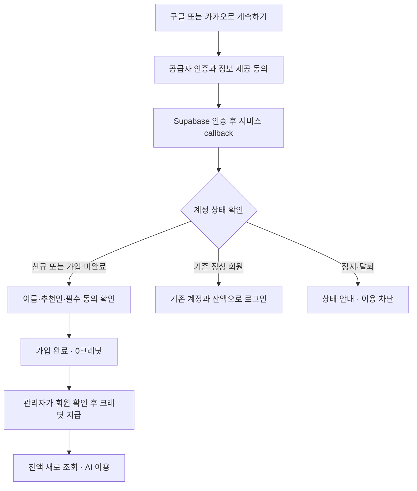

# 구글·카카오 간편가입과 관리자 수동 크레딧 지급 설계

작성: 2026-10-01 · 상태: 사용자 승인 후 로컬 구현 완료. 운영 DB 적용·인증 공급자 설정·배포 미실행. 구현·검증 기록은 §11.

## 1. 요청과 적용 범위

사용자 요청: 신규 회원이 구글 또는 카카오 계정으로 가입하도록 하고, 가입 이후 사용할 크레딧은 관리자가 직접 지급한다. 우선 설계부터 진행한다.

핵심 흐름은 **소셜 인증 → 최초 가입 정보·필수 동의 확인 → 가입 완료(0크레딧) → 관리자 지급 → AI 이용**이다. 로그인 가능 여부와 크레딧 보유 여부를 분리한다. 크레딧 지급을 기다린다는 이유로 계정 상태를 `pending`으로 바꾸지 않는다.

| 항목 | 이번 설계 |
|---|---|
| 지원 계정 | Google, Kakao |
| 이메일 가입 | 유지. 신규 회원 0크레딧 정책은 가입 방식에 관계없이 동일하게 적용하는 안 |
| 가입·재로그인 보너스 | 없음 |
| 지급 주체·수량·만료 | 관리자가 기존 회원 관리 화면에서 정함. 금액·만료일을 신규 정책으로 임의 확정하지 않음 |
| 기존 회원 | ID, 자료, 잔액, 지급·정산 이력 유지. 일괄 환산·초기화 없음 |
| 네이버·결제·추천 보상 | 이번 범위 밖 |
| 계정 연결 | Supabase의 기존 자동 연결을 수용. 사용자가 직접 연결·해제하는 새 화면은 만들지 않음 |

2026-10-01 사용자가 이 설계의 구현 진행을 승인했다. 저장소의 기존 `202609220003_credit_activate.sql` 결정과 동일하게 **모든 신규 회원 0크레딧**을 유지한다. 이메일 신규 가입에 새로운 지급 혜택을 추가하지 않는다.

## 2. 조사 기준과 확인한 기존 기능

현재 작업 폴더는 `feat/credit-ledger`, HEAD `529f4e98`이며 다른 작업의 미커밋 변경이 다수 있다. 이 폴더의 파일만 보면 최신 가입·크레딧 정책을 잘못 판단할 수 있다. 따라서 로컬에 있는 `origin/master` **`2d54b654`**의 파일을 `git show`로 함께 읽었다. 이 참조는 이번 조사에서 원격 fetch하지 않은 스냅샷이며, 운영 배포 SHA나 실제 DB 적용 상태를 뜻하지 않는다.

구현은 당시 최신 통합 브랜치에서 별도 worktree로 시작한다. 오래된 현재 브랜치의 로그인 화면이나 수동 SQL 사본을 통째로 덮어쓰지 않는다.

아래 경로는 별도 표시가 없으면 `origin/master@2d54b654` 기준이다.

| 근거 파일 | 확인 결과와 설계 영향 |
|---|---|
| `apps/web/app/signup/page.tsx` | 이름·추천인·이메일·비밀번호, 만 14세 이상 확인, 약관 동의를 받는다. 소셜 인증으로 필수 동의가 빠지면 안 됨 |
| `apps/web/lib/membership/signup-consent.ts` | 약관 버전 `2026-10-01`. 현재 이메일 가입은 인증 메타데이터에 버전·연령 확인을 저장. 개인정보 처리방침은 안내 링크이며 별도 동의 체크박스를 추가하지 않음 |
| `apps/web/app/login/page.tsx`, `lib/auth/session-window.ts` | 이미 로그인된 계정 표시·계정 전환·세션 ID에 연결된 24시간 제한이 존재. 새 OAuth에도 적용 |
| `apps/web/app/auth/confirm/route.ts` | 이메일 인증/코드 교환 경로. 새 OAuth는 별도 callback으로 분리 |
| `supabase/migrations/202609220005_member_profile.sql` | 인증 사용자에서 프로필 동기화. 이메일 인증 후 활성화하되 정지 상태와 사용자가 수정한 이름·추천인을 보존 |
| `supabase/migrations/202609220003_credit_activate.sql` | `profiles` INSERT 후 `credit_enroll_new_profile` → `credit_enroll`로 0잔액 계정 생성. 일반 신규 회원에게 지급 lot를 만들지 않음 |
| `apps/web/app/admin/page.tsx`, `admin/member-list/credit-panel.tsx` | 현재 회원·크레딧 관리 진입점은 `/admin`. `/admin/members`는 호환 리다이렉트 |
| `apps/web/app/admin/members/actions.ts` | 관리자 확인 후 `credit_admin_grant_many` 호출. `admin:<action UUID>:<user UUID>` 단위 지급 중복 방지와 감사 이력 재사용 가능 |
| `supabase/migrations/202609300001_ai_usage_control.sql` | 0크레딧에서 AI 사용을 막는 `credits_required` 정책 존재. AI 없는 광고 내보내기와 제한된 CS 도우미는 기존 예외 |
| `apps/web/lib/membership/api.ts`, `server.ts`, `usable.ts` | 화면·API에서 인증, 회원 상태, 사용량 확인. 가입 미완료 상태를 공통으로 확인하도록 확장 필요 |
| `apps/web/lib/routes.ts` | 최신 `safeNext`는 역슬래시도 거부함. 오래된 현재 작업 폴더 구현을 복사하지 않음 |

**100크레딧 정정:** `202609100005_signup_quota_100.sql`은 이전 월 한도 기본값이다. 이후의 장부 계정은 그 숫자를 지급 잔액으로 사용하지 않는다. 소셜가입을 위해 기존 0잔액 초기화·관리자 지급 시스템을 새로 만들 필요가 없다. 실제 DB에 장부 트리거가 없거나 `CREDIT_LEDGER=1`이 아니면 먼저 적용 상태를 해결해야 한다.

옵시디언에서 확인한 관련 실패 기록:

- [전환 회원의 크레딧 요청 인자 누락](C:/Users/PC/Desktop/Obsidian/AI-Sessions/wiki/errors/credit-plan-omitted-rejects-migrated-members.md): 로그인·지급만 시험하지 않고 새 장부 회원의 생성·정산까지 시험한다. 기록의 운영 상태를 오늘의 상태로 단정하지 않는다.
- [Auth 설정 전체 덮어쓰기](C:/Users/PC/Desktop/Obsidian/AI-Sessions/wiki/errors/supabase-config-push-overwrite.md): 다른 프로젝트의 실패 사례. 공급자 설정은 해당 필드만 변경하고 SMTP·CAPTCHA·기존 URL 목록을 보존한다.
- [탈퇴와 정지 혼동](C:/Users/PC/Desktop/Obsidian/AI-Sessions/wiki/errors/supabase-ban-vs-delete-withdrawal-blocks-rejoin.md): 다른 프로젝트의 사례. 소셜 재로그인에서 정지·탈퇴를 자동 해제하지 않는다.

## 3. 사용자 흐름과 화면



### 3.1 가입과 재로그인

- `/signup`, `/login` 모두 구글·카카오 버튼을 제공한다. 소셜로 가입한 회원의 다음 로그인이 막히지 않아야 한다.
- 버튼은 이메일 폼 밖에 둔다. 이메일·비밀번호 입력이나 이메일용 CAPTCHA를 소셜 버튼의 선행 조건으로 요구하지 않는다. 현재 이메일 인증·복구 흐름은 유지한다.
- 같은 창에서 이동하는 Supabase OAuth/PKCE 방식을 사용한다. 팝업, 별도 카카오 JS SDK, 별도 인증 서버를 추가하지 않는다.
- 이미 로그인 중이면 현재 계정을 먼저 표시한다. 다른 계정으로 들어가려면 기존 로그아웃 동작과 앱 세션 쿠키 정리를 완료한다. 소셜 버튼을 계정 연결 버튼처럼 사용하지 않는다.
- Google은 계정 선택을 요청한다. Kakao의 계정 선택은 공급자 세션·인앱 브라우저에 따라 달라질 수 있으므로 실제 모바일 경로에서 확인한다. 앱 로그아웃을 구글·카카오 전체 로그아웃이라고 안내하지 않는다.

### 3.2 최초 가입 완료 화면 `/auth/onboarding`

소셜 공급자의 정보 제공 동의는 이 서비스의 이용약관 동의를 대체하지 않는다. 인증 직후 한 번만 다음을 확인한다.

| 입력 | 처리 |
|---|---|
| 이메일 | 인증된 계정에서 읽어 표시. 이 화면에서 자유 입력으로 대체하지 않음 |
| 이름 | 공급자 이름/닉네임을 초기값으로 제안. 기존 `profileInputError`, 길이·정규화 규칙 사용. 비어 있으면 입력 |
| 추천인 | 기존 선택 입력. 검증·보상 없음 |
| 만 14세 이상 | 체크 필수 |
| 이용약관 | 현행 약관 링크·버전을 보여주고 체크 필수 |
| 개인정보 처리방침 | 기존처럼 링크로 안내 |

버튼은 `가입 완료`다. 서비스용 비밀번호를 요구하지 않는다. 중간에 나가도 같은 계정으로 다시 로그인하면 이 화면을 이어간다. 이미 완료한 회원에게 매번 다시 묻지 않는다.

완료 후 `HOME_AFTER_LOGIN`으로 이동하고 다음을 표시한다.

> 가입이 완료되었습니다. 현재 사용 가능한 크레딧은 0입니다. AI 기능은 관리자가 크레딧을 지급한 뒤 이용할 수 있습니다.

지급 전에도 설명서·내 계정 등은 볼 수 있다. `크레딧 새로고침` 또는 화면 재진입으로 지급 결과를 읽는다. 자동 지급 시각이나 확정되지 않은 지급량을 약속하지 않는다. 0잔액과 조회 실패를 구분해, 장부 오류를 0크레딧으로 표시하지 않는다.

### 3.3 상태 판정 순서

1. 세션 없음 → 로그인.
2. 프로필 조회 실패 → 복구 가능한 오류 안내. 무한 로그인/온보딩 리다이렉트 금지.
3. 정지·탈퇴 → 기존 제한 안내. 온보딩 완료·관리자 지급이 상태를 해제하지 않음.
4. 인증된 이메일 없음 → 지원되지 않는 인증 상태 안내. 이메일 인증을 임의로 완료 처리하지 않음.
5. 신규 소셜 회원이며 가입 미완료 → `/auth/onboarding`.
6. 가입 완료 → 서비스 화면. AI 가능 여부는 기존 크레딧 예약 정책으로 별도 판단.

## 4. 인증 처리와 계정 식별

### 4.1 두 종류의 callback URL

| 설정 위치 | 등록할 주소 |
|---|---|
| Google/Kakao 개발자 콘솔 | Supabase가 안내하는 `https://<project-ref>.supabase.co/auth/v1/callback` |
| Supabase Redirect URLs | 서비스의 `https://<service-origin>/auth/callback` |

브라우저는 `signInWithOAuth({ provider: 'google' | 'kakao', options: { redirectTo } })`로 시작한다. `/auth/callback`은 코드를 세션으로 교환하고 사용자를 서버에서 확인한다. **이 callback에서 크레딧을 지급하거나 계정을 수동 병합하지 않는다.** Supabase 인증 계정 → 프로필 → 빈 장부는 DB 트리거가 생성한다.

정상 callback, 가입 미완료, 공급자 취소, 코드 만료/재사용, verifier 유실을 구분한다. 실패 안내는 고정된 코드·문구로 매핑하고 공급자가 돌려준 긴 오류문이나 토큰을 화면·로그에 그대로 넣지 않는다. callback URL의 코드·토큰 전체를 로그에 남기지 않는다. 인증 응답은 캐시하지 않는다.

신규 callback은 운영의 `NEXT_PUBLIC_SITE_URL`에서 검증한 HTTPS origin을 기준으로 이동한다. 개발 origin은 개발 환경에서만 명시적으로 허용한다. 요청의 임의 Host/Forwarded 헤더로 외부 목적지를 결정하지 않는다. `next`는 최신 `safeNext`와 URL 정규화 후 same-origin 확인을 사용하고, 인증 페이지로 되돌아가는 순환도 막는다. 사용자 목적지는 이동 편의를 위한 값이며 권한 근거가 아니다.

미들웨어에 `/auth/callback`을 정확히 등록한다. `/auth/*` 전체를 공개하지 않는다. `/auth/onboarding`은 세션·계정 상태를 검사하되 완료 전에도 접근 가능한 제한 화면이다. 기존 24시간 세션 처리와 callback이 충돌해 인증 코드를 잃지 않는지 시험한다.

### 4.2 동일인과 재가입

- 회원·크레딧의 식별자는 **Supabase user ID**다. 이메일 문자열이나 공급자 이름으로 지급 대상을 다시 만들지 않는다.
- Supabase는 동일 이메일의 identity를 자동 연결할 수 있다. 연결 결과가 기존 user ID이면 자료·잔액을 유지하고 신규 온보딩/빈 장부를 덧씌우지 않는다. 검증되지 않은 이메일을 앱이 직접 신뢰해 연결하지 않는다. [공식 identity linking 문서](https://supabase.com/docs/guides/auth/auth-identity-linking)
- 이메일이 서로 다르면 별도 계정일 수 있다. 이번 기능은 사람 단위 중복 가입 방지나 다른 계정 간 잔액 이동을 제공하지 않는다. 관리자는 지급 전에 대상 이메일·이름·기존 지급 이력을 확인한다.
- 삭제가 끝나 새 user ID로 재가입하면 신규 정책인 0잔액이다. 기록을 남기고 닫힌 `withdrawn` 계정이나 `suspended` 계정은 OAuth 로그인으로 되살리지 않는다.

## 5. 최초 가입 정보의 저장과 서버 통제

OAuth에서는 이메일 `signUp`처럼 가입 메타데이터를 전달하는 흐름을 그대로 쓸 수 없다. 브라우저 저장소나 URL에 동의 여부를 넣고 가입 완료로 간주하지 않는다. 인증 후 서버 액션으로 완료한다.

### 5.1 프로필 확장안

기존 `profiles`에 다음 서버 소유 필드를 추가한다. 이름·추천인은 기존 컬럼을 쓴다.

| 필드 | 용도 |
|---|---|
| `signup_provider text null` | 신규 계정의 최초 가입 경로 `email/google/kakao`. 기존 회원은 NULL 보존. 현재 연결된 모든 계정 목록을 뜻하지 않음 |
| `onboarding_required boolean not null default false` | 새 소셜 계정만 true로 시작. 완료 후에도 최초 대상 표시로 보존 |
| `onboarding_completed_at timestamptz null` | 서버가 찍은 가입 완료 시각 |
| `signup_terms_version text null` | 온보딩에서 실제 표시한 약관 버전 |
| `signup_terms_accepted_at timestamptz null` | 서버가 찍은 동의 시각 |
| `signup_age_confirmed_at timestamptz null` | 만 14세 이상 확인 시각 |

`onboarding_required && !onboarding_completed_at`이 미완료다. 필드 간 제약으로 완료 시 이름·약관 버전·필수 확인 시각 누락을 허용하지 않는다. 기존 회원에 동의 기록을 소급해서 만들어 넣지 않는다. 기존 이메일 가입의 동의 저장 방식은 유지한다.

새 `auth.users` INSERT를 처리하는 `sync_auth_user_profile`에서 공급자 구분은 **Auth가 관리하는 `raw_app_meta_data`**에서 읽는다. `raw_user_meta_data.provider`는 권한 근거로 쓰지 않는다. 실제 Supabase 신규 Google/Kakao 응답·트리거 시점의 값이 이 계약과 맞는지 통합 시험을 선행한다.

기존 프로필과 충돌하면 `signup_provider`, 필수 동의 기록, 완료 여부를 덮어쓰지 않는다. `sync_auth_user_profile`의 현재 이메일 동기화·정지/탈퇴 보존·이름/추천인 보존도 유지한다. `credit_enroll_new_profile`은 그대로 재사용한다.

### 5.2 완료 액션과 권한

`completeSocialOnboarding` 서버 액션은 세션에서 본인 ID를 결정한다. 입력은 이름·추천인·필수 체크 값·화면에 표시된 약관 버전뿐이다. 클라이언트가 보낸 user ID, 역할, 크레딧, 공급자, 완료 시각을 받지 않는다.

서버는 유효 세션·이메일 확인·계정 상태·입력·약관 버전을 검사한 뒤 service-role 전용 `complete_social_onboarding` RPC를 호출한다. RPC는 프로필 행을 잠그고 상태를 다시 검사한 후 프로필 정보와 동의·완료 시각을 **한 트랜잭션**으로 쓴다. 이미 완료된 요청은 기존 성공을 반환하며 이름·동의 시각을 다시 덮어쓰지 않는다. 약관 버전이 바뀌었으면 최신 내용을 다시 보여주고 제출하게 한다. 자동 동의로 바꾸지 않는다.

새 함수의 `PUBLIC/anon/authenticated` 실행 권한과 클라이언트의 프로필 쓰기 권한을 닫는다. 기존 `getMembership`, `authenticateApiMember`, 미들웨어와 공통 회원 판정에 필요한 컬럼을 함께 추가한다. 온보딩 전용 액션은 미완료 회원도 실행 가능하되, 일반 서비스 액션·API·직접 DB 접근으로 가입 절차를 건너뛸 수 없어야 한다. 현재 직접 쓰기 가능한 테이블/RLS를 구현 단계에서 확인해 필요한 지점에만 같은 제한을 적용한다.

기존 `active` 판정은 이메일 인증과 정지를 의미한다. 가입 완료 여부를 별도 공통 함수로 조합해 화면·서버 액션·API가 같은 결론을 내리게 한다. 관리자 화면에서 미완료 계정은 `가입 정보 확인 전`으로 표시한다. 신규 미완료 계정에 대한 수동 지급은 서버와 지급 RPC에서 거절하여, 관리자도 완료된 회원에게 지급하도록 한다. 이 검사 추가 시 현행 지급 함수의 인자·중복 방지·감사 계약을 유지한다.

## 6. 크레딧 계약

### 6.1 가입 시

`auth.users` INSERT → `sync_auth_user_profile` → `profiles` INSERT → `credit_enroll_new_profile` → `credit_accounts` 1행이다. 일반 회원에게 `credit_grants`나 구독 기간을 자동 생성하지 않는다. 초기 `available/reserved/used`는 모두 0이다. 가입·로그인·화면 새로고침·이메일 변경은 지급 행위를 하지 않는다.

초기화는 인증 사용자 생성과 같은 DB 트랜잭션에서 끝나므로 일부만 생성된 계정으로 성공 처리하지 않는다. 브라우저 callback에서 별도로 지갑을 만들지 않는다. 가입 완료 전에도 빈 장부 자체는 존재할 수 있다.

기존 월 한도 `100`을 신규 잔액의 대체값으로 보여주지 않는다. 신규 소셜 기능을 켜기 전 `CREDIT_LEDGER=1`, 정본 장부 함수·트리거 설치, 신규 실제 가입의 0잔액을 확인한다. 필수 장부가 없으면 OAuth 공개를 보류한다. 가입 완료 액션에서도 장부 존재를 확인하며 없으면 준비 오류로 반환하고 관리자가 원인을 해결하게 한다.

### 6.2 관리자 지급

관리자는 **`/admin` → 회원 검색 → `플랜·크레딧` → 크레딧 지급**을 사용한다. 기존 화면을 확장하며 별도 지급 관리 화면은 만들지 않는다.

- 일반 무상 지급은 기존 `bonus`를 사용하고 수령액 0원, 지급량, 만료일, 사유를 명시한다.
- 구매·구독 지급은 기존 종류와 규칙을 유지한다. 이번 가입 기능이 구독 상품이나 결제를 자동 생성하지 않는다.
- 지급 완료는 RPC 커밋 확인 후 표시한다. 관리자의 인증·권한은 서버에서 확인하고 지급자 ID를 서버가 전달한다.
- 같은 제출의 재시도는 기존 action UUID를 재사용한다. 응답을 잃어 재시도해도 같은 지급은 한 번만 반영한다.
- 새로 의도한 추가 지급은 새 action UUID이므로 허용한다. 수동 지급을 회원당 평생 한 번으로 제한하지 않는다.
- 같은 source key를 다른 사용자·수량·종류로 재사용하면 충돌이어야 한다. 만료·사유까지 다른 재사용을 어떻게 처리하는지는 기존 함수와 대조해, 완료된 요청을 재사용해 덮어쓰지 못하도록 검증한다.
- 지급자·대상·양·종류·사유·만료·시간·요청 키가 기존 지급 및 감사 테이블에 남는다. 회수는 지급 행 삭제가 아닌 기존 회수 경로를 사용한다.

회원은 재로그인 없이 잔액을 다시 조회해 지급분을 확인한다. 새 생성 요청은 항상 서버에서 현재 잔액을 예약하므로, 화면의 오래된 숫자로 승인하지 않는다.

### 6.3 지급 전후 AI 이용

최신 `202609300001_ai_usage_control.sql`의 정책을 재사용한다. 0잔액 일반 신규 회원은 이미지 생성뿐 아니라 크레딧을 차감하지 않는 기획·분석도 기존 `credits_required` 검사로 제한된다. 기존의 AI 없는 광고 내보내기와 CS 도우미 예외(가입 후 총 10건 등)는 그대로다. 따라서 “0크레딧이면 모든 외부 호출이 0건”이라고 포괄적으로 시험하지 않고 경로별 기존 예외를 구분한다.

관리자 지급 후에는 `예약 → 제공자 실행 → 결과에 따른 확정/반환`을 그대로 사용한다. 로그인 제공자는 과금 경로의 분기 조건이 아니다. 만료·회수·전액 예약·잔액 부족은 기존 정책에 따른다. 이 작업으로 `credit_reserve`의 과금 수식이나 예약/정산 프로토콜을 새로 만들지 않는다.

## 7. 공급자 설정과 공개 조건

### Google

기존 서비스용 Google Cloud 앱을 확인하고 OAuth 웹 클라이언트, Supabase callback, 대상 사용자 범위를 설정한다. `openid/email/profile` 범위로 인증하고 Drive/Gmail 권한이나 장기 provider refresh token을 요청하지 않는다. 설정을 마친 뒤 테스트 사용자에 한정되지 않는 서비스 접근 상태를 확인한다. [Supabase Google 안내](https://supabase.com/docs/guides/auth/social-login/auth-google)

### Kakao

이 설계는 **이메일이 제공되는 카카오 로그인**을 전제로 한다. 현재 서비스는 이메일 인증·관리자 검색·탈퇴 확인에 이메일을 쓰므로, 이메일 없는 카카오 계정을 지원하기 위해 전체 회원 체계를 바꾸지 않는다.

Kakao Developers 앱의 로그인 활성화, REST API 키·클라이언트 시크릿, callback, `account_email` 제공 권한·동의 설정을 확인한다. Supabase의 `Allow users without an email`은 끈다. 카카오 앱의 이메일 제공 조건이 충족되지 않으면 카카오만 비공개 상태로 유지한다. 사용자가 이메일 제공을 거절하거나 인증된 이메일을 얻지 못하면 다른 가입 방식을 안내하고 무한 이메일 재발송 화면으로 보내지 않는다. Supabase가 최종 생성한 `email_confirmed_at`을 확인하며 이를 앱에서 위조하지 않는다. [Supabase Kakao 안내](https://supabase.com/docs/guides/auth/social-login/auth-kakao), [Kakao 설정 안내](https://developers.kakao.com/docs/ko/kakaologin/prerequisite)

시크릿은 Supabase 공급자 설정에 저장한다. 소스 코드·문서·`NEXT_PUBLIC_*`에 넣지 않는다. 버튼은 각 공급자 공식 표기·리소스를 따른다.

제안 설정명은 `NEXT_PUBLIC_AUTH_GOOGLE_ENABLED`, `NEXT_PUBLIC_AUTH_KAKAO_ENABLED`이며 기본값은 꺼짐이다. 이는 화면 노출 설정으로, Supabase 공급자 자체 활성화와 다르다. 공급자 단위 준비·실계정 시험이 끝난 후 노출한다. 장애로 신규 인증을 중단해야 하면 Supabase의 해당 공급자도 함께 제어한다.

## 8. 구현 순서와 변경 파일

각 단계는 **실패 시험(RED) → 구현 → 변경 리뷰 → 관련 회귀 검증** 순서로 진행한다. 이 문서는 그 실행 결과가 아니다.

| 단계 | 구현 범위 | 완료 기준 |
|---|---|---|
| W0 기준 확인 | 최신 통합 SHA·작업트리 분리, 운영 DB/장부/가입 트리거·공급자 설정 읽기 확인 | 기존 회원 잔액 변경 없이 실제 적용 상태와 필요한 차이 확정 |
| W1 가입 완료 상태 | 새 additive SQL, 프로필/동의 상태, 완료 RPC·서버 액션, 공통 접근 제한 | 기존 회원 유지·신규 미완료 차단·완료 재시도 안전성 DB 시험 |
| W2 OAuth 진입 | 공통 버튼, 공급자 설정, callback, 미들웨어·세션 연동 | 구글/카카오 성공·취소·재로그인·계정 전환·잘못된 callback 시험 |
| W3 수동 지급 연결 | 완료 화면·잔액 안내, 기존 관리자 화면 미완료 표시/지급 제한 | 최초 0 → 수동 지급 → 조회 → 생성·정산, 중복 지급·만료·회수 시험 |
| W4 운영 검증 | 설정·SQL·앱 적용 순서 확인, 실제 두 공급자 신규/기존 계정 검증 | 공급자별 증거가 있는 것만 공개. 코드 통과와 운영 검증 별도 기록 |

예상 변경 파일:

- 신규: `apps/web/app/_components/social-auth-buttons.tsx`, `apps/web/lib/auth/social-auth.ts`, `apps/web/app/auth/callback/route.ts`.
- 신규: `apps/web/app/auth/onboarding/page.tsx`, `actions.ts`, 입력 컴포넌트, `apps/web/lib/membership/onboarding.ts`.
- 수정: `apps/web/app/signup/page.tsx`, `login/page.tsx`, `apps/web/middleware.ts`, `lib/membership/server.ts`, `api.ts`, `types.ts`, 공통 접근 판정과 프로필 SELECT.
- 수정: `/admin` 회원 표·크레딧 액션과 관련 조회, 회원 잔액 안내. 설정 화면은 소셜 계정에 서비스 비밀번호가 자동 생성된 것처럼 표시하지 않음.
- 신규 SQL: 구현일 기준 다음 번호의 마이그레이션. 새 프로필 필드, 가입 트리거 확장, 완료 RPC, 지급 제한. 기존 0잔액 장부 초기화는 재사용.
- 수정: `apps/web/.env.example`, 필요한 인증/장부/권한 시험. 관련 배포 문서의 OAuth 설정 절차.

`202609220003_credit_activate.sql` 전체를 이번 배포에서 무조건 재실행하지 않는다. 이 SQL에는 과거 전체 회원 전환·관리자 무제한 지급 작업도 포함되어 있다. 이미 적용된 설치에서는 새 기능의 차이만 적용하고, 누락된 운영 의존성은 별도로 식별한다.

## 9. 검증 계약

| 시나리오 | 기대 결과 |
|---|---|
| Google/Kakao 각각 최초 가입 | 일반 member, 프로필·지갑 각 1개, 지급 lot 0개, 잔액 0 |
| 필수 동의/이름 누락 또는 중도 이탈 | 가입 완료되지 않음. 다음 로그인에서 이어가기. 서비스 API 우회 차단 |
| 온보딩 중 통신 단절·중복 제출 | 전체 저장 또는 전체 실패. 재시도 시 이중 완료·지급 없음 |
| 온보딩 중 관리자 정지 | 완료 액션이 정지 보존·거절 |
| 미완료 계정 직접 API/Server Action/DB 접근 | 허용한 온보딩·로그아웃 이외의 보호 작업 차단 |
| 이메일 신규 가입 | 현행 입력·메일 확인 유지, 장부 0잔액 정책 동일 |
| 같은 계정 재로그인/이메일 변경 | 원래 ID·완료 상태·자료·잔액 유지 |
| 기존 이메일 회원과 동일 이메일 소셜 로그인 | Supabase 연결 결과의 ID·잔액 보존. 신규 지급·초기화 없음 |
| 서로 다른 이메일의 소셜 가입 | 별도 계정일 수 있음. 임의 병합·잔액 이동 없음 |
| 정지/닫힌 탈퇴 계정 | 공급자 인증 성공만으로 서비스 접근 복구 안 됨 |
| callback 취소/만료/재사용/verifier 없음 | 안전한 안내·재시도. 인증 코드와 토큰 노출 없음 |
| 외부/역슬래시 next, 변조된 Host | 지정 서비스 origin 밖으로 이동 안 함 |
| 기존 세션 만료 중 OAuth, 계정 전환 | 코드 교환과 쿠키 저장 정상. 새 세션 ID로 24시간 시작 |
| 0크레딧 AI 요청 | 기존 예외 외의 AI 경로는 제공자 호출 전에 거절 |
| 관리자 아닌 지급·대상 변조·미완료 지급 | 서버/DB에서 거절, 지급·감사 잔액 변화 없음 |
| 관리자 10 지급 → 응답 유실 → 같은 요청 재시도 | 예시 잔액 10, 지급 1건. 10은 테스트 값이며 운영 지급량 아님 |
| 재로그인 없이 지급 확인 | 새 조회에 반영, 충분한 잔액이면 생성 가능 |
| 지급 후 1크레딧 생성·실패·정산 재시도 | 성공은 1회 차감, 실패 반환·중복 정산은 기존 계약 유지 |
| 만료·회수·모든 잔액 예약 | 실제 가용 잔액 기준. 예약·회수 충돌 규칙 유지 |
| 장부 누락/조회 장애 | 가짜 100 또는 0잔액으로 성공 처리하지 않음 |

단위/컴포넌트 시험, 실제 트리거를 포함한 임시 PostgreSQL 시험, Supabase 테스트 프로젝트의 실제 OAuth 시험을 나눈다. auth.users 삽입 fixture로 신규 초기화 트리거까지 실행한다. 공급자 목(mock)이나 로컬 인증 우회만으로 OAuth 검증 완료라고 하지 않는다.

관련 시험에 더해 `pnpm --filter @fixup/web typecheck`, `pnpm --filter @fixup/web lint`, `pnpm test:credit-db`를 수행하고, 공통 회원 판정 변경에 영향받는 웹 회귀 시험을 돌린다. paid provider 실제 생성 시험은 운영 검증 단계에서 비용·결과·정산 증거를 함께 남긴다.

## 10. 적용·중단·완료 기준

1. 운영 설정·DB의 현재 함수/트리거/권한을 읽어 W0 표를 채운다. 비밀값은 기록하지 않는다.
2. Google/Kakao 공급자 공개를 꺼둔 상태에서 additive SQL을 적용한다. 기존 회원은 미완료 대상이 아니므로 계속 이용 가능해야 한다.
3. 온보딩 제한·callback·화면 코드를 함께 배포한다. 이메일 회귀와 0잔액 신규 초기화를 확인한다.
4. 테스트 환경에서 실제 두 공급자 인증 → 가입 완료 → 관리자 지급 → 사용·정산을 확인한다. 운영 URL·프록시·쿠키도 따로 확인한다.
5. 운영의 공급자별 설정을 필요한 항목만 변경하고, 준비된 공급자를 노출한다. OAuth 앱 등록/권한 미준비는 코드 구현 실패와 구분한다.

문제 발생 시 해당 공급자의 새 OAuth 진입을 중단한다. 기존 지급·회원·동의 기록을 삭제하거나 기존 크레딧을 0으로 되돌리지 않는다. 새 미완료 계정이 생긴 뒤에는 온보딩 제한을 모르는 옛 앱으로 단순 rollback하지 않는다. 온보딩 제한을 유지하는 수정 배포 또는 해당 계정의 보호된 접근 차단을 유지해야 한다.

설계 검토 완료, 로컬 구현·시험 완료, 운영 DB 적용, OAuth 공급자 준비, 실제 가입·수동 지급 검증, 공개를 각각 별도로 기록한다.

## 11. 구현 기록 (2026-10-01)

### 작업 기준

- `git fetch origin` 후 `origin/master@2d54b654`에서 `feat/social-signup` 브랜치와 `.worktrees/social-signup`을 만들었다. 원래 작업 폴더의 미커밋 코드·수동 SQL은 변경하지 않았다.
- 구현은 §1의 범위대로 진행했다. 자동 지급 로직은 추가하지 않았고 기존 빈 장부 생성·관리자 지급·예약/정산을 재사용했다.
- 새 SQL은 `supabase/migrations/202610010001_social_signup.sql` 한 파일이다. 기존 프로필과 지급 이력의 일괄 초기화·환산은 없다.
- 온보딩 필드·완료 RPC, 구글/카카오 버튼·PKCE callback, 가입 확인 폼, 미들웨어·API 차단, 관리자 미완료 표시·지급 제한, 잔액 새로고침을 연결했다.

### 설계의 구체화와 리뷰 수정

- 지급 RPC 본문을 복제하지 않고 `credit_grants`, `subscription_periods`, `generation_events` INSERT의 공통 DB 트리거로 미완료 계정을 거절한다. 관리자 서버 액션에서도 미리 안내한다. 기존 RPC 인자·중복 방지·정산 수식은 유지한다.
- 기존 public RLS 테이블(프로필 제외)과 Storage objects에는 authenticated 역할의 **restrictive** 완료 정책을 추가했다. 기존 소유권·팀 정책이 주는 권한에 조건을 더하며 새 읽기 권한을 주지 않는다. 프로필 자체는 본인만 읽을 수 있어 가입을 이어갈 수 있다.
- 신규 callback은 기존 로그인 만료 처리를 먼저 통과시키지 않는다. 과거 세션 만료 시 PKCE verifier가 지워지는 일을 막는다. 온보딩 리다이렉트에도 갱신된 세션 쿠키를 전달한다.
- 완료 기록의 이름 제약이 기존 `member_withdraw`의 이름 삭제를 막는 것을 DB 시험으로 재현하고 수정했다. 탈퇴 계정은 이름을 지울 수 있고 완료·금융 기록은 보존한다.
- 소셜 회원의 장부 조회 실패/누락은 옛 월 한도 100으로 대체하지 않는다. 조회 실패와 실제 0잔액을 구분한다.
- 가입·로그인 안내를 수동 크레딧 지급 정책에 맞췄고, 가입 확인 화면의 로그아웃에서도 기존 CS 대화 정리를 유지했다.
- 첫 화면의 세션 조회도 공통 가입 완료 판정을 쓰며, 계정 전환 시 로그아웃 실패를 성공으로 안내하지 않는다.
- React 18의 비동기 transition이 저장 중 상태를 유지하지 않는 것을 컴포넌트 시험으로 재현했다. 완료 폼은 명시적인 진행 상태와 중복 제출 방지 참조를 사용한다.

### 외부 검증의 경계

원래 작업 폴더의 로컬 환경파일을 읽어 전제 조건을 확인했으나 `NEXT_PUBLIC_SUPABASE_URL`, `NEXT_PUBLIC_SUPABASE_PUBLISHABLE_KEY`, `SUPABASE_SECRET_KEY`가 없었다. 따라서 **운영 DB 함수·트리거·RLS와 Google/Kakao 공급자 설정을 확인하지 못했다.** 값을 노출하거나 설정을 변경하지 않았다. 운영에서 `CREDIT_LEDGER=1`인지도 미확인이다.

두 공급자 버튼은 기본 비공개다. 빌드 환경변수는 `.github/workflows/build-ec2-release.yml`, `apps/web/.env.example`, `deploy/ec2/app.env.example`에 연결했다. 플래그만 켜는 것으로 외부 공급자 설정이나 운영 수용 검증이 완료되지 않는다.

### 실행 방법

```powershell
# 실제 접속 정보가 든 보호된 환경파일 경로로만 실행한다. 값은 출력하지 않는다.
node --env-file=<환경파일경로> scripts/social-signup-preflight.mjs

# 임시 PostgreSQL: 운영 DB를 사용하지 않는다.
node --test scripts/tests/social-signup.test.mjs
pnpm test:credit-db

# 일반 앱 검증
pnpm --filter @fixup/web exec vitest run --maxWorkers=4
pnpm --filter @fixup/web typecheck
pnpm --filter @fixup/web lint
```

`scripts/tests/social-signup-browser.mjs`는 localhost:3107의 앱과 `auth.example.invalid` 테스트 공급자를 사용하는 UI 시험이다. 실제 외부 인증 요청은 가로챈다. 390px·1440px 가입/로그인 화면, 버튼 이동, PKCE challenge, 취소 안내, 가로 넘침과 브라우저 오류를 확인한다. 실제 Google/Kakao 인증 성공 증거로 사용하지 않는다.

검증은 운영과 분리된 현재 worktree에서 수행했다. Windows에서는 Git Bash의 `bin` 폴더를 실행 환경 PATH에 넣었다. 기본 병렬도 및 DB/빌드 동시 실행 중 기존 Bash 배포 시험이 5초를 초과했으며, 시험 제한시간·제품 코드를 바꾸지 않고 웹 worker 수를 4로 제한했다.

| 검증 | 최종 결과 |
|---|---|
| 웹 전체 | `vitest run --maxWorkers=4`: 6,148개 통과 / 기존 38개 건너뜀 (511파일 통과 / 3파일 건너뜀) |
| `pnpm test:credit-db` | 임시 PostgreSQL 123개 통과. 신규 소셜 가입 시험 12개 포함 |
| 웹 typecheck | 통과 |
| 웹 lint | 오류 없음. 기존 이미지 태그·Hook 경고는 남음 |
| Next production build | 최종 코드로 통과. 별도 `.next-social-build` 디렉터리와 테스트용 공개 설정 사용 |
| 브라우저 UI | 390px/1440px, 가입/로그인 네 경우 통과. PKCE challenge·계정 선택·취소 안내 확인, JS 오류·가로 넘침 없음 |
| 실제 OAuth·운영 DB·배포 | 미실행. 로컬 Supabase 접속 설정 없음, 공급자 준비 여부 미확인 |

로컬 UI 시험에서는 테스트용 공개 설정과 가로챈 OAuth 요청을 사용했고, 유료 AI를 호출하지 않았다. 코드 리뷰는 현재 변경에 대한 자체 검토이며 별도 독립 리뷰 완료를 의미하지 않는다. 운영 검증 전에는 `NEXT_PUBLIC_AUTH_GOOGLE_ENABLED=0`, `NEXT_PUBLIC_AUTH_KAKAO_ENABLED=0`을 유지한다.
